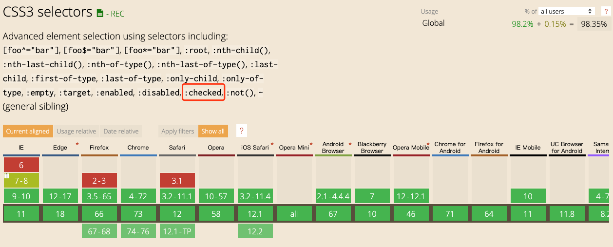

# 1.0 HTML/CSS 优化--《高效前端》学习笔记

切图的三个境界：

- 长得好看
- 灵活
- 友好的交互

## 高效前端1：能用 HTML/CSS 解决的问题就不要用 JS

### 导航高亮

给不同页面添加不同类，标识不同页面，然后设置当前页面样式，覆盖掉默认样式。

<demo-code title="演示-导航高亮" description="">
  <efe-01-demo-nav></efe-01-demo-nav>
  <highlight-code slot="codeText" lang="html">
    <!-- html -->
    <div class="demo1">
      <ul class="nav">
        <li class="nav-item item-home">首页</li>
        <li class="nav-item item-demo1">导航高亮</li>
      </ul>
    </div>
  </highlight-code>

  <highlight-code slot="codeText" lang="less">
    // less
    .nav {
      padding: 5px 10px;
      background: #000;
      color: #fff;
    }
    .nav .nav-item {
      display: inline-block;
      margin-right: 10px;
      list-style: none;
      opacity: 0.5;
      cursor: pointer;
      &:hover {
        opacity: 1;
      }
    }
    .demo1 .nav.nav-item.item-demo1 {
      opacity: 1;
    }
  </highlight-code>
</demo-code>

> 自己的想法：这种方式虽然好，但是，需要为每个导航都写一个默认和高亮样式，如果不是同一个人写的代码，在新增导航的时候，很容易会忘记去加上。

> 看到后面的时候，发现书中有这个问题相关的回答，可以用 sass 进行 for 循环实现。同时，还可以定义主题色变量。

### 鼠标悬浮时显示

hover 到某个菜单时，显示子菜单。

<demo-code title="演示-使用相邻元素" description="">
  <efe-01-demo-nav-hover-show1></efe-01-demo-nav-hover-show1>
  <highlight-code slot="codeText" lang="html">
    <!-- html -->
    <div class="demo2">
      <ul class="nav">
        <li class="nav-item item-home">首页</li>
        <li class="nav-item item-demo1">导航高亮</li>
        <li class="menu">
          <ul>
            <li>导航高亮-下级1</li>
            <li>导航高亮-下级2</li>
          </ul>
        </li>
        <li class="nav-item item-demo2">导航悬浮显示下级</li>
        <li class="menu">
          <ul>
            <li>导航悬浮显示下级-下级1</li>
            <li>导航悬浮显示下级-下级2</li>
          </ul>
        </li>
      </ul>
    </div>
  </highlight-code>

  <highlight-code slot="codeText" lang="less">
    // less
    .nav {
      position: relative;
      padding: 5px 10px;
      background: #06a992;
      color: #fff;
    }
    .nav .nav-item {
      display: inline-block;
      margin-right: 10px;
      list-style: none;
      opacity: 0.5;
      cursor: pointer;
      &:hover { // <-- 在导航菜单上需要加 hover
        opacity: 1;
      }
    }
    .demo2 .nav .nav-item.item-demo2 {
      opacity: 1;
    }
    .nav-item:hover + .menu{
      display: list-item;
    }
    .menu {
      display: none;
      position: absolute;
      top: 44px;
      min-width: 100px;
      color: #000;
      border: 1px solid #000;
      box-shadow: 0 0 5px;
      &:before { // <-- 加一个伪元素，可以避免当下拉列表和导航菜单名称之间有空隙时，鼠标往下移到下拉列表的过程中，脱离导航菜单名称而隐藏下拉列表的情况
        content: "";
        position: absolute;
        left: 0;
        top: -20px;
        width: 100%;
        height: 20px;
      }
      &:hover { // <-- 隐藏元素本身也需要加 hover
        display: list-item;
      }
    }
    ul, ul li {
      list-style: none;
    }
  </highlight-code>
</demo-code>

> 自己的想法：书中提到，可以通过 absolute 给 .menu 定位，我想了好久，都想不出来怎么实现，如果有实现方法的，请告知，谢谢！

对上面的 demo 做了布局的改变，现在可以简单的通过 absolute 来定位了，参考：

<demo-code title="演示-使用相邻元素-改变布局" description="">
  <efe-01-demo-nav-hover-show1-1></efe-01-demo-nav-hover-show1-1>
  <highlight-code slot="codeText" lang="html">
    <!-- html -->
    <div class="demo2">
      <nav>
        <ul class="nav-ul">
          <li class="nav-item item-home">首页</li>
        </ul>
        <ul class="nav-ul">
          <li class="nav-item item-demo1">导航高亮</li>
          <li class="menu">
            <ul class="menu-ul">
              <li>导航高亮-下级1</li>
              <li>导航高亮-下级2</li>
            </ul>
          </li>
        </ul>
        <ul class="nav-ul">
          <li class="nav-item item-demo2">导航悬浮显示下级</li>
          <li class="menu">
            <ul class="menu-ul">
              <li>导航悬浮显示下级-下级1</li>
              <li>导航悬浮显示下级-下级2</li>
            </ul>
          </li>
        </ul>
      </nav>
    </div>
  </highlight-code>

  <highlight-code slot="codeText" lang="less">
    // less
    nav {
      font-size: 0;
    }
    .nav-ul {
      display: inline-block;
      position: relative;
      padding: 5px 10px;
      font-size: 16px;
      background: #06a992;
      color: #fff;
    }
    .nav-ul .nav-item {
      display: inline-block;
      margin-right: 10px;
      list-style: none;
      opacity: 0.5;
      cursor: pointer;
      &:hover {
        opacity: 1;
      }
    }
    .demo2 .nav-ul .nav-item.item-demo2 {
      opacity: 1;
    }

    .nav-item:hover + .menu{
      display: list-item;
    }

    .menu {
      display: none;
      position: absolute;
      top: 44px;
      min-width: 100px;
      white-space: nowrap;
      color: #000;
      border: 1px solid #000;
      box-shadow: 0 0 5px;
      &:before { // <-- 加一个伪元素，可以避免当下拉列表和导航菜单名称之间有空隙时，鼠标往下移到下拉列表的过程中，脱离导航菜单名称而隐藏下拉列表的情况
        content: "";
        position: absolute;
        left: 0;
        top: -20px;
        width: 100%;
        height: 20px;
      }
      &:hover {
        display: list-item;
      }
      .menu-ul {
        padding-right: 1.2em;
      }
    }

    ul, ul li {
      list-style: none;
    }
  </highlight-code>
</demo-code>

<demo-code title="演示-使用相邻元素-改变布局- hover 和 mouse 事件 同时存在" description="">
  <efe-01-demo-nav-hover-show1-2></efe-01-demo-nav-hover-show1-2>
  <highlight-code slot="codeText" lang="vue">
    <template>
      <div class="demo2">
        <nav>
          <ul class="nav-ul">
            <li class="nav-item item-home">首页</li>
          </ul>
          <ul class="nav-ul" @mouseover="showSubmenu = true" @mouseout="showSubmenu = false">
            <li class="nav-item item-demo1">导航高亮</li>
            <li class="menu" :style="{ display: showSubmenu ? 'block' : 'none' }">
              <ul class="menu-ul">
                <li>导航高亮-下级1</li>
                <li>导航高亮-下级2</li>
              </ul>
            </li>
          </ul>
          <ul class="nav-ul">
            <li class="nav-item item-demo2">导航悬浮显示下级</li>
            <li class="menu">
              <ul class="menu-ul">
                <li>导航悬浮显示下级-下级1</li>
                <li>导航悬浮显示下级-下级2</li>
              </ul>
            </li>
          </ul>
        </nav>
      </div>
    </template>

    <script>
    export default {
      name: 'demo-nav-hover-show1',
      data() {
        return {
          showSubmenu: false, // <-- 代码仅作为演示用
        };
      },
    };
    </script>
  </highlight-code>
</demo-code>

可以看到，加了 mouse 事件后，鼠标悬浮后，会在元素的 style 中加上 ```display: none;```，导致 css 中的样式失效：


> 意外情况：移动端 Safari 上，触摸会触发 CSS 的 hover，hover 会很高概率地先于 touchstart 事件，此时会判断当前是显示还是隐藏状态，由于 CSS 的 hover 发挥了作用，所以判断为显示，然后又把它隐藏了。也就是说，点一次不出来，要点两次。所以最好别两个同时写。

<demo-code title="演示-使用子元素" description="">
  <efe-01-demo-nav-hover-show2></efe-01-demo-nav-hover-show2>
  <highlight-code slot="codeText" lang="vue">
    <template>
      <div class="demo">
        <ul class="nav">
          <li class="nav-item item-home">
            <span>首页</span>
          </li>
          <li class="nav-item item-demo">
            <span>鼠标悬浮显示下级下拉菜单</span>
            <ul class="menu-ul">
              <li>导航悬浮显示下级-下级1</li>
              <li>导航悬浮显示下级-下级2</li>
            </ul>
          </li>
        </ul>
      </div>
    </template>
    
    <script>
    export default {
      name: 'demo-nav-hover-show2',
    };
    </script>
    
    <style scoped lang="stylus">
    .nav {
      padding: 5px 10px;
      background: #06a992;
      color: #fff;
    }
    .nav .nav-item {
      position: relative;
      display: inline-block;
      margin-right: 10px;
      list-style: none;
      opacity: 0.5;
      cursor: pointer;
      &:hover {
        opacity: 1;
        .menu-ul {
          display: block;
        }
      }
    }
    .demo .nav .nav-item.item-demo {
      opacity: 1;
    }
    .menu-ul {
      display: none;
      position: absolute;
      left: 0;
      top: 44px;
      min-width: 100px;
      padding-right: 1.2em;
      white-space: nowrap;
      border: 1px solid #000;
      box-shadow: 0 0 5px;
      color: #000;
      background-color: #fff;
      &:before { // <-- 加一个伪元素，可以避免当下拉列表和导航菜单名称之间有空隙时，鼠标往下移到下拉列表的过程中，脱离导航菜单名称而隐藏下拉列表的情况
        content: "";
        position: absolute;
        left: 0;
        top: -20px;
        width: 100%;
        height: 20px;
      }
    }
    ul, ul li {
      list-style: none;
    }
    </style>
  </highlight-code>
</demo-code>

使用子元素的话，hover 可直接加在父容器上，隐藏元素本身不需要加 hover。

### 自定义 radio/checkbox 的样式

可以使用 :checked 代替鼠标点击事件。

<demo-code title="演示-自定义 radio/checkbox" description="">
  <efe-01-demo-radio-checkbox></efe-01-demo-radio-checkbox>
  <highlight-code slot="codeText" lang="html">
    <!--html-->
    <div class="radio-checkbox">
      <label class="control-label">
        <input type="radio" value="value1" name="radio">
        radio1: <span class="radio"></span>
      </label>
      <label class="control-label">
        <input type="radio" value="value2" name="radio">
        radio2: <span class="radio"></span>
      </label>
  
      <label class="control-label">
        <input type="checkbox" value="value1">
        checkbox <span class="checkbox"></span>
      </label>
    </div>
  </highlight-code>
  
  <highlight-code slot="codeText" lang="less">
    // less
    input[type=checkbox],
    input[type=radio] {
      display: none;
    }
    .control-label {
      margin-right: 10px;
      display: inline-block;
      cursor: pointer;
    }
    .radio {
      position: relative;
      display: inline-block;
      width: 16px;
      height: 16px;
      vertical-align: middle;
      border: 1px solid #3eaf7c;
      border-radius 50%;
    }
    input[type=radio]:checked + .radio {
      box-shadow: 0 0 3px #3eaf7c;
      &:after {
        content: '';
        width: 50%;
        height: 50%;
        display: block;
        position: absolute;
        left: 50%;
        top: 50%;
        transform: translateX(-50%) translateY(-50%);
        background: #3eaf7c;
        border-radius 50%;
      }
    }
    .checkbox {
      position: relative;
      display: inline-block;
      width: 16px;
      height: 16px;
      vertical-align: middle;
      border: 1px solid #3eaf7c;
    }
    input[type=checkbox]:checked + .checkbox {
      box-shadow: 0 0 3px #3eaf7c;
      &:after {
        content: '✓';
        display: block;
        position: absolute;
        left: 50%;
        top: 50%;
        transform: translateX(-50%) translateY(-50%);
        color: #3eaf7c;
      }
    }
  </highlight-code>
</demo-code>

使用 :checked 属性时，要注意[兼容性](https://caniuse.com/#search=%3Achecked)：



### 多列等高

#### padding 补偿法

设置一个很大的 padding-bottom，这样容器被最大的子元素撑开时，其他的子元素使用可以用 padding-bottom 来补偿缺少的高度。然后设置一个同方向的 margin-bottom 负值，可以抵消设置的 padding-bottom。
同时设置父容器的 ```overflow: hidden;```，将多余的部分裁剪（隐藏）掉。

<demo-code title="演示-多列等高-padding" description="">
  <efe-01-demo-cols-same-height1></efe-01-demo-cols-same-height1>
  <highlight-code slot="codeText" lang="html">
    <!--html-->
    <div class="demo">
      <div class="col col1">
        <p class="title">苹果</p>
        <p class="des">
          苹果，是水果中的一种，是蔷薇科苹果亚科苹果属植物，其树为落叶乔木。
        </p>
      </div>
      <div class="col col2">
        <p class="title">香蕉</p>
        <p class="des">
          香蕉（学名：Musa nana Lour.）芭蕉科芭蕉属植物，又指其果实，热带地区广泛种植。
        </p>
      </div>
      <div class="col col3">
        <p class="title">水蜜桃</p>
        <p class="des">
          水蜜桃（学名：Prunus persica 、meltingfleshed peach）：蔷薇科、桃属植物。南方品种群中肉质柔软多汁呈软溶质的一类品种。果实顶部平圆，熟后易剥皮，多粘核。
        </p>
      </div>
      <div class="col col4">
        <p class="title">菠萝</p>
        <p class="des">
          菠萝（学名：Ananas comosus），是热带水果之一。
        </p>
      </div>
    </div>
  </highlight-code>
  <highlight-code slot="codeText" lang="less">
    // less
    .demo {
      overflow: hidden;
    }
    .col {
      float: left;
      width: 20%;
      padding-top: 10px;
      padding-left: 10px;
      padding-right: 10px;
      padding-bottom 2000px; // <-- 设置 padding-bottom
      margin-bottom: -2000px; // <-- 设置 margin-bottom
      margin-right: 10px;
      border: 1px solid #000;
      border-radius: 5px;
    }
  </highlight-code>
</demo-code>

> 缺点：底部的 border 没有了，底部圆角也不显示了。

#### table 布局

table 中的每个 td 都是等高的，所以可以设置容器 ```display: table;```，设置里面的子元素 ```display: table-cell;```。将子元素的宽度设大点，可以实现等分。

<demo-code title="演示-多列等高-table" description="">
  <efe-01-demo-cols-same-height2></efe-01-demo-cols-same-height2>
  <highlight-code slot="codeText" lang="html">
    <!--html-->
    <!--省略 html 代码-->
  </highlight-code>
  <highlight-code slot="codeText" lang="stylus">
    // stylus
    .demo
      display table
      border-spacing 20px // <-- 设置间隔
      word-break break-all
    .col
      display table-cell
      width 1000px // <-- 设置很大的宽度，table 自动平分宽度
      padding: 10px
      border 1px solid #000
      border-radius 5px
  </highlight-code>
</demo-code>


> 注意：虽然 table 布局可以实现等分，但是有一种情况需要注意，就是英文单词很长，没有设置 word-break 的时候，这种情况是不会自动等分的。


这种布局的另一个好处，就是可以在媒体查询时，实现响应式。

可以尝试拉伸屏幕，观察下面的布局变化。（大屏显示每行四列，中屏显示每行两列，小屏显示每行一列。）

<demo-code title="演示-多列等高-table-响应式" description="">
  <efe-01-demo-cols-same-height3></efe-01-demo-cols-same-height3>
  <highlight-code slot="codeText" lang="html">
    <!--html-->
    <div class="demo">
      <div class="col col1">
        <p class="title">苹果</p>
        <p class="des">
          苹果，是水果中的一种，是蔷薇科苹果亚科苹果属植物，其树为落叶乔木。
        </p>
      </div>
      <div class="col col2">
        <p class="title">香蕉</p>
        <p class="des">
          香蕉（学名：Musa nana Lour.）芭蕉科芭蕉属植物，又指其果实，热带地区广泛种植。
        </p>
      </div>
      <!--加了个 tr 实现一行两列布局-->
      <span class="tr"></span>
      <div class="col col3">
        <p class="title">水蜜桃</p>
        <p class="des">
          水蜜桃（学名：Prunus persica 、meltingfleshed peach）：蔷薇科、桃属植物。南方品种群中肉质柔软多汁呈软溶质的一类品种。果实顶部平圆，熟后易剥皮，多粘核。
        </p>
      </div>
      <div class="col col4">
        <p class="title">菠萝</p>
        <p class="des">
          菠萝（学名：Ananas comosus），是热带水果之一。
        </p>
      </div>
    </div>
  </highlight-code>
  <highlight-code slot="codeText" lang="stylus">
    // stylus
    .demo
      display table
      border-spacing 20px // <-- 设置间隔
      word-break break-all
    .col
      display table-cell
      width 1000px // <-- 设置很大的宽度，table 自动平分宽度
      padding: 10px
      border 1px solid #000
      border-radius 5px
    .tr
      display none
    @media (max-width: 500px)
      .demo
        display block // <-- 可以覆盖原来的样式，实现响应式布局
      .col
        display block // <-- 可以覆盖原来的样式，实现响应式布局
        width: 100%
    @media (max-width: 1024px) and (min-width: 501px)
      .tr
        display table-row // <-- 实现一行两列布局
  </highlight-code>
</demo-code>

可以看到，从一行两列布局拉伸到宽屏时，.tr 的 ```display: none;``` 不起作用了。因为 table 布局已经计算好了。要解决这个问题，需要借助 JavaScript。

<demo-code title="演示-多列等高-flex" description="">
  <efe-01-demo-cols-same-height4></efe-01-demo-cols-same-height4>
  <highlight-code slot="codeText" lang="html">
    <!--html-->
    <div class="demo">
      <div class="col col1">
        <p class="title">苹果</p>
        <p class="des">
          苹果，是水果中的一种，是蔷薇科苹果亚科苹果属植物，其树为落叶乔木。
        </p>
      </div>
      <div class="col col2">
        <p class="title">香蕉</p>
        <p class="des">
          香蕉（学名：Musa nana Lour.）芭蕉科芭蕉属植物，又指其果实，热带地区广泛种植。
        </p>
      </div>
      <div class="col col3">
        <p class="title">水蜜桃</p>
        <p class="des">
          水蜜桃（学名：Prunus persica 、meltingfleshed peach）：蔷薇科、桃属植物。南方品种群中肉质柔软多汁呈软溶质的一类品种。果实顶部平圆，熟后易剥皮，多粘核。
        </p>
      </div>
      <div class="col col4">
        <p class="title">菠萝</p>
        <p class="des">
          菠萝（学名：Ananas comosus），是热带水果之一。
        </p>
      </div>
    </div>
  </highlight-code>
  <highlight-code slot="codeText" lang="less">
    // less
    .demo {
      display: flex;
      word-break break-all
      .col {
        width: 25%;
        padding: 10px;
        margin: 0 10px;
        border: 1px solid #000;
        border-radius: 5px;
      }
    }
  </highlight-code>
</demo-code>

### 根据个数显示不同样式

需求：

例如有 1 ~ 3 个 item 显示在同一行，但 item 的个数不一定，如果只有 1 个，那 item 占宽 100%；如果有 2 个，每个占 50%；如果有 3 个，每个占 33%。

> ```:nth-last-child(an+b)``` 这个 CSS 伪类匹配文档树中在其之后具有 an+b-1 个兄弟节点的元素，其中 n 为正值或零值。它基本上和 :nth-child 一样，只是它从结尾处反序计数，而不是从开头处。[MDN](https://developer.mozilla.org/zh-CN/docs/Web/CSS/:nth-last-child)

<demo-code title="演示-根据个数显示不同样式1" description="">
  <efe-01-demo-diff-items-diff-style1></efe-01-demo-diff-items-diff-style1>
  <highlight-code slot="codeText" lang="html">
    <!--html-->
    <div class="demo">
      <ul class="list clearfix">
        <li class="list-item">一行 1 个</li>
      </ul>
      <ul class="list clearfix">
        <li class="list-item">一行 2 个</li>
        <li class="list-item">一行 2 个</li>
      </ul>
      <ul class="list clearfix">
        <li class="list-item">一行 3 个</li>
        <li class="list-item">一行 3 个</li>
        <li class="list-item">一行 3 个</li>
      </ul>
    </div>
  </highlight-code>
  <highlight-code slot="codeText" lang="less">
    // less
    .demo {
      width: 100%;
      .list {
        .list-item {
          display: inline-block;
          float: left;
          text-align: center;
          border: 1px solid #000;
          box-sizing: border-box; // <-- 设置 box-sizing
          background-color: #4abf8a;
          &:nth-child(2) {
            background-color: #3a8ee6;
          }
          &:nth-child(3) {
            background-color: yellow;
          }
          width: 100%; // <-- 一行显示一个时，使用该样式
          &:first-child:nth-last-child(2),
          &:first-child:nth-last-child(2) ~ .list-item { // <-- 一行显示两个时，使用该样式，&:first-child:nth-last-child(2) 指向第一个元素
            width: 50%;
          }
          &:first-child:nth-last-child(3),
          &:first-child:nth-last-child(3) ~ .list-item { // <-- 一行显示两个时，使用该样式，&:first-child:nth-last-child(2) 指向第一个元素
            width: 33.3%;
          }
        }
      }
    }
  </highlight-code>
</demo-code>

> 需要注意的是，如果 item 有 border，这样设置是不行的，因为 border 也会占据一定的宽度。设置一下 ```box-sizing: border-box;``` 即可。


需求：

手机屏幕比较小，左边图标比较多，一行排不下，把右边的电话换行，隐藏竖线。(左边图标个数不定)

> 感觉需求描述不完整，想象不出这种场景，无法实现代码。

<demo-code title="演示-根据个数显示不同样式2" description="">
  <efe-01-demo-diff-items-diff-style2></efe-01-demo-diff-items-diff-style2>
  <highlight-code slot="codeText" lang="html">
    <!--html-->
    <!--暂时无法实现代码-->
  </highlight-code>
</demo-code>

### 使用表单提交

请求提交方式：

- AJAX
- 表单提交

假设：

首页有一个搜索的表单，单击 SEARCH 跳到列表页。

演示省略...

### 自动监听回车事件

略...

### 巧用 CSS3 伪类（pseudo class）

- :focus
- :invalid

<demo-code title="演示-CSS3 伪类" description="">
  <efe-01-demo-css3-pseudo-class></efe-01-demo-css3-pseudo-class>
  <highlight-code slot="codeText" lang="html">
    <!--html-->
    <form class="form">
      <p>利用 :focus 伪类实现 focus 时，放大镜颜色加深。</p>
      <div class="form-group">
        <label for="search" class="form-label"></label>
        <div class="form-control">
          <input class="form-control-input" id="search" type="text">
          <i class="icon-search fas fa-search"></i>
        </div>
      </div>
      <p>利用 :invalid 伪类进行校验。</p>
      <div class="form-group">
        <label for="email" class="form-label"></label>
        <div class="form-control">
          <input class="form-control-input" id="email" type="email">
          <span class="btn">Next</span>
        </div>
      </div>
    </form>
  </highlight-code>
  <highlight-code slot="codeText" lang="less">
    // less
    .form-control {
      position: relative;
    }
    .form-control-input {
      padding: 0 32px;
      &:focus + .icon-search { // <-- :focus 伪类
        color: #3eaf7c;
      }
      &:invalid + .btn { // <-- :invalid 伪类
        opacity: .5;
        cursor: default;
      }
    }
    .icon-search {
      position: absolute;
      left: 10px;
      top: 14px;
      color: #ddd;
    }
    .btn {
      height: 40px;
      line-height: 1.5;
      padding: 5px 10px;
      position: absolute;
      right: 0;
      top: 0;
      transform: translateX(100%);
      border: 1px solid #3eaf7c;
      border-radius: 3px;
      background: #3eaf7c;
      color: #fff;
      cursor: pointer;
    }
  </highlight-code>
</demo-code>

### 其他

需求：

hover 时显示提示信息。不想用 title，也不想用 JavaScript，更不想引入第三方库。

<demo-code title="演示-CSS3 伪类" description="">
  <efe-01-demo-attr></efe-01-demo-attr>
  <highlight-code slot="codeText" lang="html">
    <!--html-->
    <p>
      Hello
      <span class="tip" data-title="Frontend Development">FED</span>
    </p>
  </highlight-code>
  <highlight-code slot="codeText" lang="less">
    // less
    .tip {
      position: relative;
      &:hover:before {
        padding: 5px;
        content: attr(data-title);
        position: absolute;
        left: 50%;
        top: -230%;
        transform: translateX(-50%);
        white-space: nowrap;
        border-radius: 5px;
        background: #000;
        color: #fff;
      }
      &:hover:after {
        position: absolute;
        top: -10px;
        left: 50%;
        transform: translateX(-50%);
        content: '';
        width: 0;
        height: 0;
        border-style: solid;
        border-width: 12px;
        border-color: transparent;
        border-top-color: #000;
      }
    }
  </highlight-code>
</demo-code>