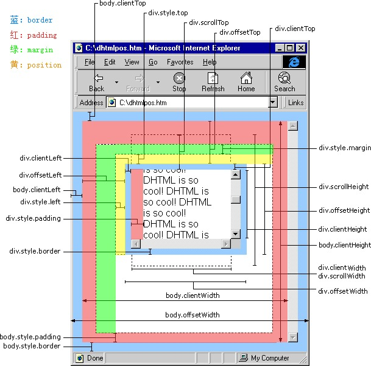

# 面试题-小题目汇总

## 判断浏览器是 IE

```js
function isIE() {
  // IE 6 - 11
  if (window.ActiveXObject || "ActiveXObject" in window) {
    return true;
  }
  // edge
  if (navigator.userAgent.indexOf("Edge") > -1) {
    return true;
  }
  return false;
}
```

## 把数字转换成逗号分隔的形式

```js
// 第一种
const str = '1234567890';
const format = str.replace(/\B(?=(\d{3})+(?!\d))/g, ','); // 不适用小数

// 第二种
const str = '1234567890';
const format = str.toLocaleString(); // "1,234,567,890" 可配置 locales 和 options
// 见 https://developer.mozilla.org/en-US/docs/Web/JavaScript/Reference/Global_Objects/Number/toLocaleString
```

## 新版chrome阻止自动填充

For new Chrome versions you can just put autocomplete="new-password" in your password field and that's it. I've checked it, works fine.

```html
<input autocomplete="new-password">
```

## 图片加载失败出现边框

```css
img[src=''],
img:not([src]){
  opacity: 0;
}
```

## 图片裁剪(拉伸适配全屏)

```css
// 第一种 缺点：只能适配 1920 以下的
.banner-bg {
  position: absolute;
  left: 0;
  top: 0;
  right: 0;
  bottom: 0;
  width: 1920px;
  margin: 0 calc(50% - 960px);
}

// 第二种
.banner-bg {
  position: absolute;
  left: 0;
  top: 0;
  right: 0;
  bottom: 0;
  background-position: center 0;
  background-size: cover;
}
```

## 去除 input[type=number] 的默认样式

```css
input[type=number] {
  -moz-appearance: textfield;
}
input[type=number]::-webkit-inner-spin-button,
input[type=number]::-webkit-outer-spin-button {
  -webkit-appearance: none;
  margin: 0;
}
```

## JS中的各种位置



## JS 基础题

### mutiply()

实现数组每个元素自己相乘，并添加到原数组中

```js
const arr = [1, 2, 3, 4, 5];
arr.mutiply();
console.log(arr); // [1, 2, 3, 4, 5, 1, 4, 9, 16, 25]
```

实现方式：

```js
// 考察原型链
Array.prototype.multiply = function() {
  const multiples = this.map(item => item * item);
  return this.push(...multiples);
}
```

### 0.2 + 0.1

在 JS 中，以上代码返回 false，为什么？

```js
0.2 + 0.1 === 0.3; // false
```

```js
(0.1 * 10 + 0.2 * 10) / 10;
// 或
Math.round((0.1 + 0.2) * 1e12) / 1e12; // (0.1 * 1e12 + 0.2 * 1e12) / 1e12;
```

### JS 中的数据类型

- 原始数据类型（primitive data type）
- 引用类型（reference type）

6 种原始数据类型：

- Number
- String
- Boolean
- Undefined
- Null
- Symbol

引用类型：Object

### 用 JS Proxy 实现数据绑定

