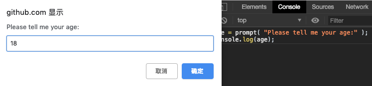
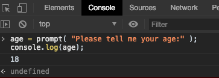

# 1.1 关于编程--你不知道的JavaScript

## 关于编程（Chapter 1: Into Programming）

本章介绍一些编程的基本概念——特别是关于 JavaScript 的，以及如何学习和理解本系列其余的章节。

对于刚接触编程和（或）JavaScript 的同学，本书将简略地探讨你需要做些什么准备。

本书在一个非常高的水平上开始介绍编程的基本原理。这主要是为了给没有编程经验但想通过书本学习的同学提供一个从 JavaScript 视角出发理解编程的方法。

第一章是关于“编程”的概述。除了本章外，还有很多关于介绍编程的资源，这些资源能帮你深入理解这些概念，我非常希望你们能去学习下。

一旦你对一般的编程基础得心应手了，那么第二章将引导你熟悉 JavaScript 的编程风格。第二章将介绍 JavaScript 是什么，但是需要注意的是，这并不是一个全面的索引，而是本书其余部分的索引。

如果你已经非常了解 JavaScript 了，那么快速浏览下第三章，然后跳到相应的章节去学习。

### 代码 (Code)

让我们从头开始吧。

一个程序——经常被称为源代码或代码，其实就是一系列的指令，告诉计算机执行什么任务。通常代码保存在一个文本文件中，但是，JavaScript 代码可以在浏览器的开发者工具的控制台中直接输入，稍后会讲到。

有效格式的规则和指令集被称为计算机语言，有时候也被称为语法。和英语一样，告诉你怎么拼写单词，怎么通过单词和标点符号组成有效的句子。

#### 声明语句（Statements）

在计算机语言中，一个声明语句由一组单词、数字和操作符组成，执行某个特定的任务。在 JavaScript 中，声明语句如下所示：

```js
a = b * 2;
```

字符 a 和 字符 b 被称为变量。变量就像盒子一样，你可以存放任何东西。在程序中，变量保存着程序需要使用的值（比如数字 42）。可以把变量想象成值的符号占位符。

相对应的，2 就是值本身，叫作字面量。因为它没有保存在变量中。

字符 = 和 字符 * 被称为操作符。它们用值和变量来进行相应操作，如：赋值、乘法。

大部分的 JavaScript 声明语句以分号```;```结尾。

声明语句 ```a = b * 2;``` 告诉计算机，获取变量 b 的值，将其与 2 相乘，然后保存在变量 a 中。

程序就是很多类似声明语句的集合，这个集合描述了实现程序目的的步骤。

#### 表达式（Expressions）

声明语句由一个或多个表达式组成。一个表达式，可以是一个变量或一个值，也可以是一个包含多个变量、值和操作符的组合。

例如：

```js
a = b * 2;
```

以上声明语句包含四个表达式：

```
2          —— 字面量表达式
b          —— 变量表达式，就是检索当前的值
b * 2      —— 算法表达式，就是相乘
a = b * 2; —— 赋值表达式，就是将 b * 2 的表达式的结果赋值给变量 a
```

一个独立的表达式也叫作 *表达式声明语句*，例如：

```js
b * 2;
```

这种表达式声明语句不是很普遍，也没有什么用。一般的，它对程序的运行没有任何影响。它只会检索 b 的值，将 b 与 2 相乘，至于相乘后的结果，它不会进行任何处理。

另一种更通用的表达式声明语句叫作 *调用表达式* 声明语句，因为这个声明语句本身就是一个方法的调用表达式。

```js
alert(a);
```

#### 执行程序（Executing a Program）

这些编程声明语句是怎么告诉计算机该怎么做的呢？需要被执行的程序，就叫作运行程序。

类似 ```a = b * 2``` 这种声明语句，有助于开发者读和写。但是，对计算机来说，这并不是一种能直接理解的形式。所以会用一种特殊的程序（一种解释器或一种编译器）将代码编译成计算机能懂的指令。

对于一些计算机语言来说，每次程序执行的时候，指令的转换就会从上到下，一行一行的执行，这通常被称为 *解释* 代码。

对于其他语言，会提前执行指令的转换，叫作 *编译* 代码。所以当程序执行的时候，代码已经被编译成计算机指令了。

普遍认为，JavaScript 是解释型的，因为每次 JavaScript 代码执行时，会对代码进行处理。但是这并不完全正确。JavaScript 引擎实际上会在运作时编译程序，并立即执行编译完成的代码。

::: tip
注：想了解 JS 编译，可查看本系列的 __作用域和闭包__ 一节。
:::

### 试一试

这一章将用简单的 JavaScript 代码片段来介绍各种编程概念。

必须强调的是：当你在学习本章时——你可能会重温好几遍——你应该自己敲代码来练习每个概念。最简单的方法就是在浏览器的开发者工具的控制台中敲代码（比如谷歌、火狐浏览器等）。

::: tip
提示：一般来说，可以通过快捷键或菜单选项来打开开发者工具。可参考：["Mastering The Developer Tools Console"](http://blog.teamtreehouse.com/mastering-developer-tools-console)。想在 console 控制台中输入多行代码，可同时按 shift 键 + enter 键，就会切换到新的一行。一旦按了 enter 键，就会执行依据输入的代码。
:::

现在来熟悉下在控制台中运行代码。首先，建议先在浏览器中打开一个新的 tab 页，我喜欢在地址栏中输入 ```about:blank``` 。然后，确保 console 控制台开启，就如上面提到的。

现在，敲入如下代码，看它如何运行。

```js
a = 21;
b = a * 2;
console.log(b);
```

在 chrome 浏览器的控制台中敲入上面的代码，可看到如下图所示：


继续尝试！学习编程最好的方法就是敲代码！

#### 输出 (Output)

在前面的代码中，我们用到了 ```console.log(...)```。简单的来看下那行代码是什么意思。

你可能已经猜到了，但那正是在 console 控制台中打印文本（向用户输出）的方式。对于这个语句，有两个特征必须明确。

第一，```log(b)``` 部分叫作 *函数调用*。在这个过程中，我们将变量 b 传递给 log 函数，函数拿到这个变量后，在 console 控制台中打印出结果。

第二，console 是一个对象，log 函数位于这个对象中。在第二章，将详细讲解 *对象及其属性*。

另一种输出的方式，就是执行一个 ```alert()``` 声明语句，例如：

```js
alert(b);
```

执行后会发现这次并没有在控制台中打印出结果，而是在浏览器中打开了一个确认弹窗，弹窗中显示变量 b 的内容。使用 ```console.log(...)``` 比使用 ```alert(...)``` 更有利于学习代码，运行起来也更方便，因为你可以一次性打印多个结果，而不用打断浏览器的交互。

本书中，将采用 ```console.log(...)``` 来输出内容。

#### 输入 （Input）

在谈到输出时，肯定会想到输入（比如接收用户的输入）。

对于 HTML 页面来说，最常用的方法就是展示 form 表单（像文本框），供用户输入，然后通过 JavaScript 方法读取这些值，并存入到相应的变量中。

但是，对于简单的学习和演示，可以用更简单的方法。使用 ```prompt(...)``` 方法：

```js
age = prompt("Please tell me your age:");
console.log(age);
```

结果如下图：



输入内容并点击确定后，会发现输入的内容存在了变量中，然后通过 ```console.log(...)``` 打印出来了：



简单起见，在学习基本的编程概念时，本书中的例子不会需要用到输入。

既然已经知道如何使用 ```prompt(...)```，如果想挑战下自己，可以在例子中探索使用输入。

#### 操作符（Operators）

操作符就是用来操作变量和值的。我们已经见过两个 JS 操作符：=（赋值操作符）和 * （乘法操作符）。

* （乘法操作符）执行算术乘法。很简单，对吧？

=（赋值操作符）用来赋值。我们先计算 = 的右侧（原始值），然后将结果存到 = 的左侧所指定的变量中（目标变量）。

::: warning
警告：这似乎看起来很奇怪，赋值的顺序是倒过来的。有些人可能喜欢将顺序倒过来，原始值在左侧，目标变量在右侧，像这样：```42 -> a```（这不是 JavaScript ！）然而，像 ```a= 42``` 这种形式，以及类似的变种形式，在现代的编程语言中普遍流行。如果感觉到不自然，在脑海中多预演几遍这种顺序来习惯它就好了。
:::

考虑：

```js
a = 2;
b = a + 1;
```

将 2 赋值给 a， 然后将 1 加到 a 上，得到结果 3，将结果存到 b 中。

当不是赋值操作时，在每个程序中，都需要一个关键字 ```var```。这是声明（创建）变量的基本方法。

在使用变量前，需先通过命名来声明变量。一个变量在一个作用域中仅需要声明一次，之后根据需要可多次使用。例如：

```js
var a = 20;
a = a + 1;
a = a * 2;
console.log(a);
```

下面是几种 JS 中最普遍的操作符：

* 赋值操作符：=
* 算术操作符：-（相减）、+（相加）、*（相乘）、/（相除）
* 复合赋值操作符：+=、-=、*=、/=。复合赋值操作符是算术操作和赋值操作的结合。```a += 2``` 等同于 ```a = a + 2```
* 累加/累减操作符：++、--。```a++``` 类似于 ```a = a + 1```
* 对象属性访问操作符：.，如 ```console.log()```
  对象就是一些值，储存着其他一些在特定命名空间的值，这些值叫作属性。obj.a 的意思就是一个叫作 obj 的对象值，obj 上面有一个叫作 a 的属性。属性也可通过 ```obj['a']``` 这种方式访问。
* 相等操作符：==（相等 loose-equals）、===（严格相等 strict-equals）、!=（不相等）、!== （严格不相等），比如 a == b
* 比较操作符：<（小于）、>（大于）、<=（小于等于）、>=（大于等于）
* 逻辑操作符：&&（并且）、||（或者）

::: tip
注：更多操作符知识可参考 MDN 上的 ["Expressions and Operators"](https://developer.mozilla.org/en-US/docs/Web/JavaScript/Guide/Expressions_and_Operators)
:::

### 值和类型

当你在手机店问售货员某个手机多少钱时，他们回答 ”九十九“ ($99)。他们给出的是一个实际的数字型的美元数字，表示你买手机需要付这么多钱。如果你想买两部这种手机，你可以通过心算，将 99 乘以 2，算出 198 的结果。

如果那个售货员拿起另一种手机，说这个手机是 ”免费“ 的（可能是带手势引号的），这次给出的不是一个数字，而是另一种表述方式—— ”免费“ ——代表你只需要花费 $0.00 。

当你问起这部手机是否包含充电器时，回答可能是 “是” 或者 “否”。

类似的，在程序中表达某些值时，你会选择不同表现形式，看你想拿这些值做什么。

在编程术语中，这些值的不同表现形式叫作 *类型*。JavaScript 对每种类型都有内置的类型，叫作 *原始值*。

* 当需要做数学运算时，需要数字
* 当需要在屏幕上打印值时，需要字符串
* 当需要在程序中做判断时，需要布尔值（true 或 false）

直接包含在源代码中的值叫作字面量。字符串字面量由双引号或单引号包裹——区别在于个人风格喜好。数字和布尔字面量：42、true

考虑以下代码：

```js
"I am a string";
'I am also a string';

42;

true;
false;
```

除了 数字、字符串、布尔类型外，编程语言还提供了 数组、对象、函数等类型。在本章和稍后的章节中会详细讨论。

#### 类型转换

如果你有一个数字，想打印到屏幕上，你需要将它转换成字符串类型。在 JavaScript 中，这叫作 “强制转换”。类似的，如果有人在电商网页的表单中输入了一系列的数字，这些数字其实是字符串，你如果想用这些数字来进行数学运算，就需要将它们强制转换成数字类型。

JS 中提供了许多的强制类型转换的方法。

```js
var a = "42";
var b = Number(a);

console.log(a); // "42"
console.log(b); // 42
```

如上所示，使用 ```Number(...)``` （内置函数）显示地将其他类型强制地转换为数字类型。这很简单明了。

当时需要争议的是，当比较两种不同类型的值时发生了什么，这中间可能发生了隐式转换。

当比较字符串 "99.99" 和数字 99.99 时，大部分人认为是相等的。但它们是不完全相等的，为什么？他们是对一个值的两种表现形式，两种*类型*。你可以说他们 相等(loosely equal)。

为了帮你解决这些问题，JS 有时会隐式地将值转换为相匹配的类型。

所以当使用 == 相等操作符比较 "99.99" 和 99.99 时，JS 会将左侧的 "99.99" 转换成数字类型的 99.99，就变成了 ```99.99 == 99.99```，结果当然是 true。

虽然目的是为了帮助我们，但是隐式转换会引起困惑，如果没有学习过转换规则的话。大部分的开发者没有学习过，一般的感觉是，隐式转换令人困惑，且会引起无法预期的bug，损害程序，所以应该避免使用。这有时候也被认为是这门语言的设计缺陷。

我们可以学习隐式转换的机制，对于这些想严格对待JS编程的人来说，更应该学习这种机制。不仅仅是因为学习后，对隐式转换不再困惑，而且它可以使我们的程序变得更好。这是值得花时间去学习的。

::: tip
注：关于更多转换的信息，可参考本系列的 “类型和语法” 的 第二章 和 第四章。
:::

### 代码注释

...

### 变量

...

### 块

当你在手机店买新手机结账时，售货员会经过一系列的步骤。

类似的，在代码中，我们会将一系列的声明语句分组，这叫作块。在 JavaScript 中，一个块就是将一个或多个声明语句包含在一个大括号中：

```js
var amount = 99.99;
// 一个普通的块
{
  amount = amount * 2;
  console.log(amount);  // 199.98
}
```

这种独立的块是有效的，但是在 JavaScript 程序中不常见。一般的，块会跟在一些控制语句后，比如 if 判断语句 或 循环语句。

```js
var amount = 99.99;
if (amount > 10) {        // <-- 跟在 if 判断语句后的块
  amount = amount * 2;
  console.log(amount);  // 199.98
}
```

下一节，我们会讨论 if 语句。我们可以看到，包含两个声明语句的块跟在 if 语句后，而且只有当这个条件成立时，才会执行里面的语句。

::: tip
注：不像其他声明语句，如 ```console.log();```，块语句不需要分号结尾。
:::

### 条件语句

“你想给屏幕贴个保护膜吗？只要 $9.99。” 热情的手机店售货员问你。你可能需要先查看下钱包或银行账户，然后回答这个问题。但是显然，这只是一个简单的 “是否” 问题。

在我们的程序中，有很多方法可以表示条件。

最常见的一种就是 if 判断语句。实质上就是这样，“如果条件成立，就这样做...”。

```js
var bank_balance = 302.13;
var amount = 99.99;

if (amount < bank_balance) {
  console.log("我要买这个手机！");
}
```

if 判断语句需要一个包含在小括号中的表达式，这个表达式一般是 true 或 false。

在这个程序中，我们的表达式是 ```amount < bank_balance```，这会根据银行的存款数（bank_balance）这个变量来判断这个表达式是 true（条件成立） 或者是 false（条件不成立）。

如果条件不成立，可以提供另一种选择，叫作 else 从句。如：

```js
const ACCESSORY_PRICE = 9.99;

var bank_balance = 302.13;
var amount = 99.99;

amount = amount * 2;

// 可以买得起其他的东西吗？
if (amount < bank_balance) {
  console.log("我要买这个配件！");
  amount = amount + ACCESSORY_PRICE;
}
// 否则:
else {
  console.log("不，谢谢！");
}
```

这里，如果 ```amount < bank_balance``` 条件成立，会打印出 "我要买这个配件！"，然后将 9.99 加到变量 amount 中。否则的话，就会打印出 "不，谢谢！"，变量 amount 不改变。

之前讨论过 值和类型，那些不符合预期类型的值会被转换成相应的类型。if 语句期望得到一个布尔类型，当传入的表达式不是一个布尔类型时，将会发生类型转换。

JavaScript 定义一个列表，包含了一些特殊值——*假值*——当这些值被转换为布尔类型时，被认为是 false（条件不成立） 的，包括了 0 和 ""（空字符串）。其他不在这个列表里的，被认为是 *真值*——当转换为布尔类型时，被认为是 true（条件成立）。真值包括 99.99 和 "free"。关于更多 *真值&假值* 的知识可参考第二章。

除了 if 判断外，条件语句还有其他形式。如 switch 语句，是一系列的 if () else () 语句的简写。循环语句（loop）通过条件来判断是否继续或停止。

::: tip
注：关于更多可能会发生隐式转换的类型转换的条件语句的测试表达式，可参考本系列 “类型和语法” 的第四章。
:::

### 循环语句

在忙碌的时候，顾客想与售货员说话，需要排队等候。只要还有人在排队，售货员就需要不停地服务。

重复一系列的行为直到条件不成立——换句话说——只要条件成立，就一直重复，这是程序循环的工作。虽然循环有不同的形式，但是它们都满足这个基本行为。

一个循环包含了一个测试条件和一个代码块。每次循环块被执行的时候，就是一个 *迭代*。

下面的例子，用 while 循环语句 和 do..while 循环语句来说明循环块会重复执行，直到条件不成立的概念。

```js
while (numOfCustomers > 0) {
  console.log("需要什么帮助吗？");

  numOfCustomers = numOfCustomers - 1;
}

do {
  console.log("需要什么帮助吗？");

  numOfCustomers = numOfCustomers - 1;
} while (numOfCustomers > 0);
```

...

### 函数

手机店售货员可能不会随身携带计算器来算出税费和总价。这个方法她定义一次，就可以重复使用无数次。巧的是，公司里正好有一个收银台，内置了这些方法。

类似的，在程序中肯定也需要将代码任务拆分成可复用的小块，而不是重复地重复你自己（双关语）。这么做的方式就是定义函数。

函数就是一部分命名的代码，可以通过名称调用，每次调用，里面的代码都会执行。

```js
function printAmount() {
  console.log(amount.toFixed(2));
}

var amount = 99.99;
printAmount(); // "99.99"

amount = amount * 2;
printAmount(); // "199.98"
```

函数可以接收参数——传入的值，也可以返回值。

```js
function printAmount(amt) {
  console.log(amt.toFixed(2));
}

function formatAmount() {
  return "$" + amount.toFixed(2);
}

var amount = 99.99;

printAmount(amount * 2);  // "199.98"

amount = formatAmount();
console.log(amount ;  // "$99.99"
```

函数 ```printAmount()``` 接收一个叫做 amt 的参数，函数 ```formatAmount()``` 返回一个值。当然也可以在一个函数中同时使用参数和返回值。

通常，使用函数是为了多次使用同一段代码，但是也可能只是为了将一些相关的代码组织起来，即使这些代码只会调用一次。

```js
const TAX_RATE = 0.08;

function calculateFinalPurchaseAmount(amt) {
  // 计算新的总价（包含税费）
  amt = amt + (amt * TAX_RATE);
  // 返回新的总价
  return amt;
}

var amount = 99.99;
amount = calculateFinalPurchaseAmount(amount);
console.log(amount.toFixed(2));  // "107.99"
```

虽然 ```calculateFinalPurchaseAmount()``` 只调用了一次，将代码封装在一个命名函数中，会使代码逻辑看起来更加简洁。如果函数中有更多语句，那么好处就会更加明显。

#### 作用域（Scope）

如果你想买的手机型号店里没有，那么售货员就不能将手机卖给你。她只能卖店里的手机。你只能到其他店里去找想要的手机型号。

对此，编程里有一个专门的术语：作用域（scope），严格来说，应该叫词法作用域（lexical scope）。在 JavaScript 中，每个函数有自己的作用域。作用域就是很多变量的集合以及访问这些变量的规则。只有函数内部的代码可以访问该函数作用域内部的变量。

同一个作用域内的变量名必须是唯一的。不能同时有两个相同的变量名 a 存在。但是不同的作用域内可以存在相同的变量名 a。

```js
function one() {
  // 这里的 a 只属于函数 one
  var a = 1;
  console.log(a);
}

function two() {
  // 这里的 a 只属于函数 two
  var a = 2;
  console.log(a);
}

one();  // 1
two();  // 2
```

同时，一个作用域可以嵌套在另一个作用域中，就像生日派对上小丑在一个气球中吹大另一个气球一样。如果一个作用域嵌套在另一个作用域中，最内层的代码可访问这两个作用域中的变量。

```js
function outer() {
  var a = 1;

  function inner() {
    var b = 2;
    // 这里可同时访问 a 和 b
    console.log(a + b); // 3
  }

  inner();

  // 这里只能访问 a
  console.log(a);
}

outer();
```

词法作用域规则规定一个作用域中的代码可以访问自己和外部作用域中的变量。

所以函数 inner 内部的代码可以变量 a 和 b，函数 outer 中的代码只能访问变量 a，但是不能访问 b ，因为变量 b 只存在于函数 inner 的作用域中。

重新看下之前的代码片段：

```js
const TAX_RATE = 0.08;

function calculateFinalPurchaseAmount(amt) {
  amt = amt + amt * TAX_RATE;
  return amt;
}
```

根据词法作用域规则，函数 ```calculateFinalPurchaseAmount``` 内部可以访问常量 TAX_RATE，即使并没有将 TAX_RATE 当参数传入。

::: tip
注：关于更多词法作用域的知识，可参考本系列 *作用域和闭包* 的前三章。
:::

### 练习

学习编程除了练习没有其他方法。在我看来，写的再清楚也不能使你成为一个程序员。

记住这点，然后尝试练习本章中学习的概念。我会先提出需求，然后你先自己尝试写，然后再查看下面的代码，看我是怎么实现的。

* 写一个程序计算你所购买的手机的总价。你要一直买手机直到银行账户里的存款用完（提示：循环）。同时还要为每个手机购买配件，只要购买总金额在你可承受的范围内。
* 计算完上面的价格后，加上税，打印出总金额——以适当的格式显示金额。
* 检查银行账户的存款，看是否负担得起。
* 为 税率、手机价格、配件价格、可承受范围、银行账户设置常量。
* 定义一些方法，用于计算税额、格式化价格（以$开头，保留两位小数）。
* 额外的挑战：尝试在程序中加入输入功能，如在 _输入_ 一章中提到的 ```prompt```。比如，可能需要向用户确认银行账户。

先不要看答案！一定要自己先尝试着写！

答案：

```js
const SPENDING_THRESHOLD = 200;
const TAX_RATE = 0.08;
const PHONE_PRICE = 99.99;
const ACCESSORY_PRICE = 9.99;

var bank_balance = 303.91;
var amount = 0;

function calculateTax(amount) {
  return amount * TAX_RATE;
}

function formatAmount(amount) {
  return "$" + amount.toFixed( 2 );
}

// keep buying phones while you still have money
while (amount < bank_balance) {
  // buy a new phone!
  amount = amount + PHONE_PRICE;

  // can we afford the accessory?
  if (amount < SPENDING_THRESHOLD) {
    amount = amount + ACCESSORY_PRICE;
  }
}

// don't forget to pay the government, too
amount = amount + calculateTax( amount );

console.log(
  "Your purchase: " + formatAmount( amount )
);
// Your purchase: $334.76

// can you actually afford this purchase?
if (amount > bank_balance) {
  console.log(
    "You can't afford this purchase. :("
  );
}
// You can't afford this purchase. :(
```

### 总结

...

## 参考：

https://github.com/getify/You-Dont-Know-JS/blob/master/up%20%26%20going/ch1.md
