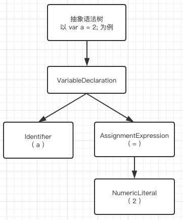
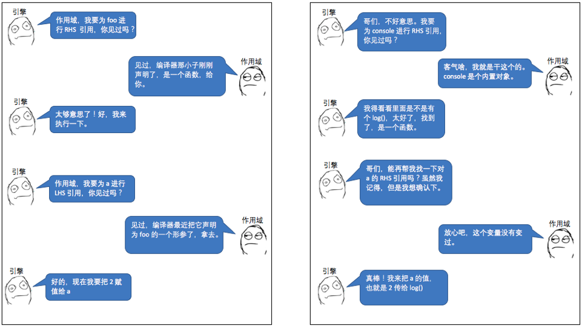
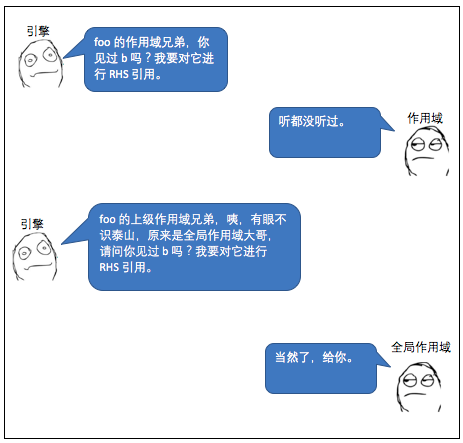
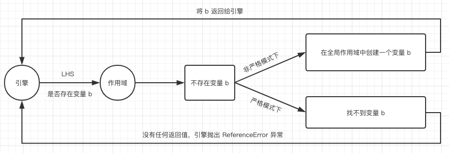

# 2.1 什么是作用域？--你不知道的JavaScript

## 什么是作用域？（Chapter 1: What is Scope?）

几乎所有语言最典型的能力之一就是可以将值储存在变量中，之后再重新获取和修改这些值。事实上，这种存取变量值的能力为程序提供了一种状态。

没有这样一种概念，程序可以执行某些任务，但是会受到很大的限制，而且也不会很有趣。

但是程序中加入变量带来了下面几个有趣的问题：这些变量住在哪里？换句话说，它们储存在哪里？而且最重要的是，当程序需要它们的时候是怎么找到它们的？

这些问题证明需要一个定义明确的规则，规定在哪里储存变量，并且之后怎么找到它们。我们把这套规则叫作：作用域。

但是，在哪里以及怎么设置这些作用域规则呢？

### 编译原理（Compiler Theory）

尽管 JavaScript 被认为是动态、解释性语言，但事实上，它是编译型语言。

它不像其他传统的编译语言一样，会提前编译，而且编译的结果也不能像分布式系统一样，相互之间可以移植。

虽然如此，JavaScript 引擎和其他传统的编译器执行的步骤大致相同——可能比我们所知道的更加复杂。

在传统的编译语言过程中，一段代码——你的程序，在执行前会经历典型的三个步骤，这个过程叫作编译。

传统编译流程：


* 1、Tokenizing/Lexing（分词/词法分析）：将一串字符串分解成（对机器来说）有意义的代码块，叫作词法单元（tokens）。比如，```var a = 2;```，会被拆分成这样的词法单元：```var```, ```a```, ```=```, ```2```和```;```。空格可能会被认为是一个词法单元，也可能被认为不是，这取决于它是否有意义。

> 注：分词（Tokenizing）和词法分析（Lexing）的区别在于词法单元的识别是通过有状态还是无状态来进行的。简单来说，如果词法单元生成器是通过有状态的解析规则来判断 a 是独立的词法单元还是其他词法单元的一部分时，那么这个过程就叫作词法分析（Lexing）。

* 2、Parsing（解析）：解析就是将词法单元流（数组）转换成代表程序语法结构的嵌套元素树。这个数叫作抽象语法树（AST，Abstract Syntax Tree）。

以 ```var a = 2;``` 为例，抽象语法树有一个叫作 VariableDeclaration 的顶级节点，
接下来是一个叫作 Identifier 和  AssignmentExpression 的子节点，AssignmentExpression 节点又有一个叫作 NumericLiteral 的子节点，具体见下图：



* 3、Code-Generation（代码生成）：把 AST 转换成可执行代码的过程。依赖的语言、目标平台不同，这个过程就有很大的不同。

与其纠结于令人混乱的细节，不如直接这么认为，有这么一种方法，可以将 ```var a = 2;``` 转换成 AST 树，之后再转换成一套机器指令，这套指令可以创建一个叫作 a 的变量（包括内存分配），然后将某个值储存在 a 中。

> 注：引擎管理系统资源的细节比我们所能探究的更深，所以我们只需要理所当然地认为，引擎可以根据需要创建和储存变量就可以了。


*编译流程*

和其他语言编译器一样，JavaScript 引擎远比上面三个步骤复杂得多。比如，在解析和代码生成的过程中，有特定的步骤会对执行性能进行优化，包括冗余元素优化等。

JavaScript 不会像其他语言的编译器一样，有大量的时间去进行优化，因为 JavaScript 的编译没有一个提前构建的步骤。

JavaScript 编译，大部分情况下，发生在代码执行前的几微妙（甚至更短）。为了保证最佳性能，JavaScript 使用了很多小策略（比如 JITs，惰性编译、热重载编译），这些都不在我们要讨论的作用域的话题的范围内。

> JIT：Just-in-time compilation（即时编译）

简单起见，我们可以这么认为，JavaScript 的片段必须在执行前（通常是刚好在执行前）编译。所以 JavaScript 编译器在拿到 ```var a = 2;``` 这个程序时，会先编译，然后（通常是马上）执行它。

### 理解作用域

通过对话方式来学习作用域。

#### 角色

- 引擎
- 编译器
- 作用域


#### 对话

先来看一段代码：

```js
var a = 1;
```

这不仅仅是一段声明语句，JavaScript 引擎认为它是两个独立的声明：

- 编译器在编译时的声明
- 引擎在运行时的声明

以 ```var a = 1;``` 为例，演示引擎、编译器、作用域三者是如何工作的

首先编译器会先通过分词将代码分解为词法单元，然后解析成抽象语法树。但是当进到代码生成阶段时，处理方式会和预期的不太一样。


> 变量的赋值操作会执行两个动作：1. 编译器在当前作用域中声明一个变量； 2. 运行时引擎在作用域中查找该变量，找到便赋值，找不到抛出异常。

#### 编译器有话说

引擎执行编译器生成的代码时，会通过查找作用域来判断 a 是否已经被声明，引擎执行不同的查找，最终会影响查找的结果。

在我们这个例子中，引擎执行的是左侧查找（LHS），另一个查找方式叫作右侧查找（RHS）。

__LHS && RHS__

先来张图，解释什么是 LHS、RHS


看下面代码，加深理解

```js
console.log(a); // 对 a 的引用是 RHS 引用。因为没有对 a 赋值，而是查找并取得 a 的值。
```

```js
a = 2; // 对 a 的引用是 LHS 引用。不用关心 a 的值是什么，只需要为 = 2 这个赋值操作找到一个目标。
```

> 注：LHS 和 RHS 并不一定是指赋值操作符（=）的左侧和右侧，可能还有其他的赋值方式，最好把它理解为 LHS —— 谁是赋值操作的目标，RHS —— 谁是赋值操作的源头。

下面代码包含了 LHS 和 RHS：

```js
function foo (a) {
    console.log(a);
}
foo(2);
```

最后一行的 ```foo(..)``` 函数调用是一个查找 foo 的 RHS 查询，意思是，"找到 foo 并把它给我"。(..)意味着 foo 可以被调用，所以 foo 最好真的是一个函数。

这里可能会忽略 ```a = 2``` 这段代码，这段代码发生在将参数 2 传入函数 foo() 时，这个时候，2 被赋值给了参数 a。为了给参数 a 赋值， 需要进行一次 LHS 查找。

当将 a 传递给 ```console.log(..)``` 时，进行的是一次 RHS 查找。

```console.log(..)``` 需要一个引用才能执行。所以这里会进行一次对 console 对象的 RHS 查找，在它的属性中查找是否有一个叫 log 的方法。

#### 引擎和作用域的对话

```js
function foo (a) {
    console.log(a);
}
foo(2);
```



#### 小测验

把自己当做引擎，同作用域进行一次“对话”。

```js
function foo (a) {
    var b = a;
    return a + b;
}
var c = foo(2);
```

> 1. 找到其中所有的LHS查询。(这里有3处!)
> 2. 找到其中所有的RHS查询。(这里有4处!)

### 作用域嵌套

当一个块或函数嵌套在另一个块或函数中时，就发生了作用域嵌套。因此，在当前作用域中无法找到该变量时，引擎会在当前嵌套的作用域的外层继续查找，直到找到该变量，或抵达最外层作用域（全局作用域为止）。

看以下代码：

```js
function foo (a) {
    return a + b;
}

var b = 1;
foo(2);
```

对 b 进行的 RHS 引用无法在函数 foo 内部完成，但可以在上一级作用域(在这个例子中就 是全局作用域)中完成。

我们来模拟一下以上代码的引擎与作用域的对话。



遍历嵌套作用域的简单规则就是：引擎从当前执行作用域开始查找变量，如果找不到，就一直向上一级作用域查找。如果到达了最后一级作用域，就会停止查找，无论是否找到这个变量。

#### 用高楼来打比方

为了将作用域的处理过程形象化，我希望大家可以把它想象成一幢大楼。


这幢大楼代表了程序的嵌套作用域规则。大楼的第一层代表了当前执行的作用域，最高层就是全局作用域。

LHS 和 RHS 都会在当前楼层查找，如果没找到，就坐电梯到上面一层去查找，没找到再到上一层，以此类推。当到达了最顶层（全局作用域），你可能找到了你想找的，也可能找不到。此时，无论如何，都要停止查找了。

### 异常

考虑以下代码：

```js
function foo (a) {
  console.log(a + b);
  b = a;
}

foo(2);
```

当第一次对 b 进行 RHS 查找时，找不到 b。这就是说 b 是一个 "未声明的" 变量，因为在作用域中找不到。

如果在任何一个嵌套的作用域中进行 RHS 查找都找不到变量，那么引擎会抛出 ReferenceError（引用错误） 的错误。需要注意的是，这个错误类型是 ReferenceError（引用错误）。


相反，如果引擎执行的是 LHS 查找，直到全局作用域都没有找到——如果程序是在非严格模式下——全局作用域中会创建一个以这变量名命名的新的变量，把返回给引擎。

"之前没有，但是我很热心的帮你创建了一个。"。

ES5 中引入的严格模式，和 *正常模式或宽松模式或懒惰模式* 行为上有很大差异。其中一点就是，严格模式不允许自动或隐式地创建全局变量。这种情况下，LHS 查找时，就无法返回全局变量给引擎，引擎就会抛出类似于 RHS 查询时的 ReferenceError（引用错误） 错误。



如果在 RHS 找到一个变量，你尝试对这个变量做一些不合理的操作，比如对一个非函数类型的变量进行函数调用操作，或则在 null 或 undefined 对象上访问一个属性，引擎会抛出另一种错误类型 TypeError（类型错误）。

ReferenceError（引用错误）是作用域识别失败相关的错误，而 TypeError（类型错误）则意味着，作用域识别成功，但对结果的操作是非法或不合理的。
