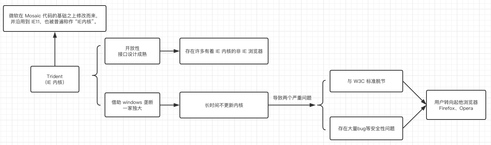
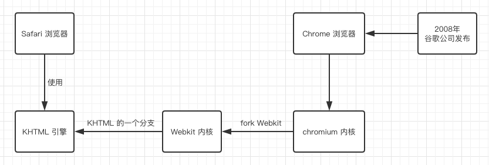
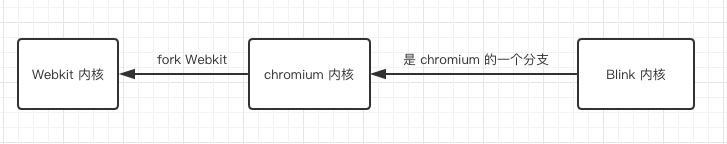

# 你对浏览器内核的理解？

浏览器内核又可以分成两部分：渲染引擎(layout engineer 或者 Rendering Engine)和 JS 引擎。

它负责取得网页的内容（HTML、XML、图像等等）、整理讯息（例如加入 CSS 等），以及计算网页的显示方式，然后会输出至显示器或打印机。

JS 引擎则是解析 Javascript 语言，执行 javascript 语言来实现网页的动态效果。

最开始渲染引擎和 JS 引擎并没有区分的很明确，后来 JS 引擎越来越独立，内核就倾向于只指渲染引擎。

有一个网页标准计划小组制作了一个 [ACID](#ACID)（见附录） 来测试引擎的兼容性和性能。

内核的种类很多，如加上没什么人使用的非商业的免费内核，可能会有 10 多种，但是常见的浏览器内核可以分这四种：Trident、Gecko、Blink、Webkit。

## Trident （IE 内核）

## Gecko （Firefox 内核）

## Webkit 内核

## Chromium/Blink 内核

Chrome 内核：[blink](https://www.chromium.org/blink)

# 附录：

## [ACID](https://en.wikipedia.org/wiki/ACID_\(computer_science\))

- Atomicity（原子性）：一个事务（transaction）中的所有操作，或者全部完成，或者全部不完成，不会结束在中间某个环节。事务在执行过程中发生错误，会被恢复（Rollback）到事务开始前的状态，就像这个事务从来没有执行过一样。即，事务不可分割、不可约简。

- Consistency（一致性）：在事务开始之前和事务结束以后，数据库的完整性没有被破坏。这表示写入的资料必须完全符合所有的预设约束、触发器、级联回滚等。

- Isolation（隔离性）：数据库允许多个并发事务同时对其数据进行读写和修改的能力，隔离性可以防止多个事务并发执行时由于交叉执行而导致数据的不一致。事务隔离分为不同级别，包括读未提交（Read uncommitted）、读提交（read committed）、可重复读（repeatable read）和串行化（Serializable）。

- Durability（持久性）：事务处理结束后，对数据的修改就是永久的，即便系统故障也不会丢失。

## [Mosaic](https://en.wikipedia.org/wiki/Mosaic_\(web_browser\))

# 参考

http://web.jobbole.com/84826/  