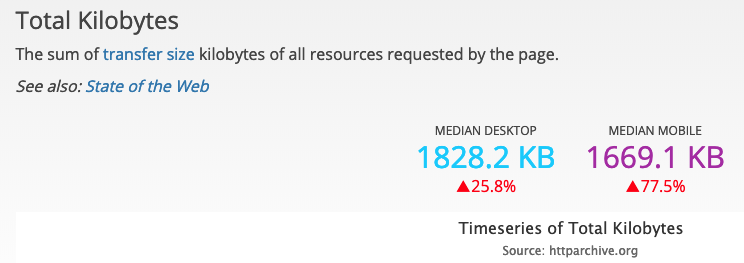

# 图片优化

## 为什么要优化

先来说说，为什么会关注图片优化？

在某次官网开发中，需要用到首页的 Banner 图，当时 UI 切的图很大，所以每次刷新时，都能清晰地看到图片从上到下缓慢加载的过程，用户体验非常不好。

像官网这样的网站，文本和图片是用户最先看到的资源，需要保证优先加载图片和文字，提高用户体验。

那么，有什么方法可以对图片进行优化呢？

正好，前段时间在“掘金”上购买了一本小册《前端性能优化原理与实践》，里面有谈到图片的优化，正好记录下来，供自己学习，以及与大家分享。

先来一张图片（来自 [httparchive](https://httparchive.org/reports/page-weight#bytesTotal)）：

可以看到页面请求的图片的体积，800+K，看起来还好是吧？但是！看下面的图。

和整体的资源体积相对比一下，就会发现图片占据的体积是非常大的，图片的优化就显得非常必要！

## 优化方案

说到图片优化，一般网上的资源，不外乎以下几点：

- 图片懒加载
- 预加载     -- 针对幻灯片、相册，可将当前展示图片的前一张和后一张预先加载。
- 特殊编码    -- 如果图片过大，可以使用特殊编码的图片。
- 图片压缩

概念有些泛，也不知道如何使用。

修言老师（《前端性能优化原理与实践》的作者）就讲得比较好，他通过区分不同的业务场景，使用不同的优化方案来达到优化效果。

书中有一些前置的知识，需要学习，这里就不细说了，只作一个大致介绍。

### JPEG/JPG

关键字：有损压缩、体积小、加载快、不支持透明

#### 使用场景

适用于大的背景图、轮播图、banner图。

所以，在官网的 banner 图使用时，就比较推荐使用 jpg 格式的图片。

### PNG-8 与 PNG-24

关键字：无损压缩、质量高、体积大、支持透明

#### 使用场景

适用于呈现小的Logo、颜色简单且对比强烈的图片或背景。

### SVG

关键字：文本文件、体积小、不失真、兼容性好

缺点：渲染成本高，学习成本高

#### 使用场景

适用于小的图标。也有一些在线的 SVG 字体库，比如：[fontawesome](https://fontawesome.com/)、[iconfont](https://www.iconfont.cn/)等。

### Base64

关键字：文本文件、依赖编码、小图标解决方案

[Base64](https://zh.wikipedia.org/wiki/Base64) 是作为[雪碧图](https://developer.mozilla.org/zh-CN/docs/Web/Guide/CSS/CSS_Image_Sprites)的补充存在的。两者都是为了减少网络请求次数，提升网页性能。

对图片进行 Base64 编码，可以将图片编码直接写入 CSS 或 HTML 代码中，减少请求。

#### 使用场景

适用于非常小的 Logo。

为什么不把大图也用 Base64 编码？

*截图来自维基百科*

可以看到编码后体积会变成原来的 4/3 ，体积明显增加。

使用 Base64 需要满足的条件：

- 图片的实际尺寸很小
- 图片无法以雪碧图的形式与其他小图结合
- 图片更新频率非常低

### WebP

[WebP](https://developers.google.com/speed/webp/) 官网上提到：

> WebP is a modern image format that provides superior lossless and lossy compression for images on the web. Using WebP, webmasters and web developers can create smaller, richer images that make the web faster.  
> WebP lossless images are 26% smaller in size compared to PNGs. WebP lossy images are 25-34% smaller than comparable JPEG images at equivalent SSIM quality index.  
> Lossless WebP supports transparency (also known as alpha channel) at a cost of just 22% additional bytes. For cases when lossy RGB compression is acceptable, lossy WebP also supports transparency, typically providing 3× smaller file sizes compared to PNG.

Webp 是一种现代的图片格式，它提供无损和有损压缩的图片。它的无损图片比 PNG 格式的图片体积小 26%，有损图片比 JPEG 格式的图片体积小 25-34%。

缺点：兼容性

## 总结

学了不用等于没学，将理论应用于实践中，才是最好的学习方式，加油！💪