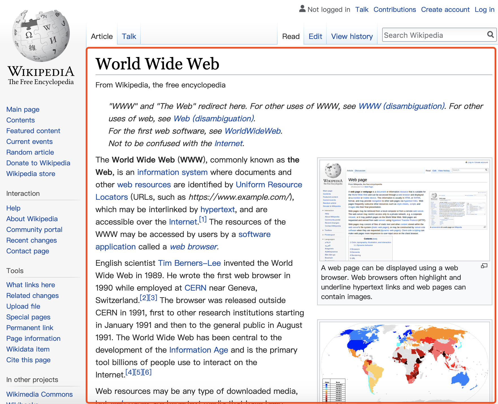

# HTML 语义2--如何运用语义类标签来呈现 wiki 网页

## aside


根据前一篇的语义定义，左侧侧边栏属于 aside 内容，使导航性质的工具内容。

## article



文章主体部分具有明确的独立性，所以用 article 包裹。

## hgroup、h1、h2


代码：

```html
<hgroup>
  <h1>World Wide Web</h1>
  <h2>From Wikipedia, the free encyclopedia</h2>
</hgroup>
```

效果如下：

<hgroup>
  <h1>World Wide Web</h1>
  <h2>From Wikipedia, the free encyclopedia</h2>
</hgroup>


abbr 表示缩写，WWW 是 World Wide Web 的缩写，所以文中出现的 WWW 都应用 abbr 标签。

```html
<abbr title="World Wide Web">WWW</abbr>
```

效果：

<abbr title="World Wide Web">WWW</abbr>

## hr


这里的横线是否需要 hr 标签？

> HTML ```<hr>``` 元素表示段落级元素之间的主题转换（例如，一个故事中的场景的改变，或一个章节的主题的改变）。([MDN](https://developer.mozilla.org/zh-CN/docs/Web/HTML/Element/hr))

看 hr 的定义，就知道，这里不适合用 hr。

## p


接下来是三段 note，表示额外的注释。

HTML 中没有 note 相关的语义，所以可以用 p 标签，加上 class="note" 来实现。

## strong


这里的 World Wide Web(WWW) 和 the Web 都加粗了，表示这些词很重要，所以用 strong 标签。

> Strong 元素 (```<strong>```)表示文本十分重要，一般用粗体显示。([MDN](https://developer.mozilla.org/zh-CN/docs/Web/HTML/Element/strong))

```html
<p>
The <strong>World Wide Web(WWW)</strong>, commonly known as <strong>the Web</strong> is an ...
</p>
```

效果如下：

<p>
The <strong>World Wide Web(WWW)</strong>, commonly known as <strong>the Web</strong> is an ...
</p>

## blockquote、q、cite

> HTML ```<blockquote>``` 元素（或者 HTML 块级引用元素），代表其中的文字是引用内容。通常在渲染时，这部分的内容会有一定的缩进（注 中说明了如何更改）。若引文来源于网络，则可以将原内容的出处 URL 地址设置到 cite 特性上，若要以文本的形式告知读者引文的出处时，可以通过 ```<cite>``` 元素。([MDN](https://developer.mozilla.org/zh-CN/docs/Web/HTML/Element/blockquote))

> HTML引用（ Citation）标签 (```<cite>```) 表示一个作品的引用。

> HTML引用标签 (```<q>```)表示一个封闭的并且是短的行内引用的文本. 这个标签是用来引用短的文本，所以请不要引入换行符; 对于长的文本的引用请使用 ```<blockquote>``` 替代。([MDN](https://developer.mozilla.org/zh-CN/docs/Web/HTML/Element/q))


这里的作品名称 "What is hte difference between the Web and the Internet?" 应用 cite 标签。

```html
<cite>"What is the difference between the Web and the Internet?"</cite>. W3C Help and FAQ. W3C. 2009. Archived from the original on 9 July 2015. Retrieved 16 July 2015.
```

效果：

<cite>"What is the difference between the Web and the Internet?"</cite>. W3C Help and FAQ. W3C. 2009. Archived from the original on 9 July 2015. Retrieved 16 July 2015.

在文章结尾 references 里面的作品也应该用 cite 标签。


## time

> HTML time 标签(```<time>```) 用来表示24小时制时间或者公历日期，若表示日期则也可包含时间和时区。   
> 此元素意在以机器可读的格式表示日期和时间。 有安排日程表功能的应用可以利用这一点。


```html
<cite>"What is the difference between the Web and the Internet?"</cite>. W3C Help and FAQ. W3C. 2009. Archived from the original on <time datetime="2015-07-09">9 July 2015</time>. Retrieved <time datetime="2015-07-16">16 July 2015</time>.
```

效果：

<cite>"What is the difference between the Web and the Internet?"</cite>. W3C Help and FAQ. W3C. 2009. Archived from the original on <time datetime="2015-07-09">9 July 2015</time>. Retrieved <time datetime="2015-07-16">16 July 2015</time>.

## figure、figcation

> HTML ```<figure>``` 元素代表一段独立的内容, 经常与说明（caption） ```<figcaption>``` 配合使用, 并且作为一个独立的引用单元。当它属于主内容流（main flow）时，它的位置独立于主体。这个标签经常是在主文中引用的图片，插图，表格，代码段等等，当这部分转移到附录中或者其他页面时不会影响到主体。

比如：

```html
<figure>
  
  <figcaption>An elephant at sunset</figcaption>
</figure>
```

效果：

<figure>
  
  <figcaption>An elephant at sunset</figcaption>
</figure>

文章的右侧有几张图和文字，应该用 figure 和 figcaption 标签。


```html
<figure>
  
  <figcaption>A web page can be displayed using a web browser. Web browsers often highlight and underline hypertext links and web pages can contain images.</figcaption>
</figure>
```

效果：

<figure>
  
  <figcaption>A web page can be displayed using a web browser. Web browsers often highlight and underline hypertext links and web pages can contain images.</figcaption>
</figure>

## dnf

> HTML 定义元素 (```<dfn>```) 表示术语的一个定义。([MDN]())


```html
The terms Internet and World Wide Web are often used without much distinction. However, the two terms do not mean the same thing. The <dnf>Internet</dnf> is a global system of interconnected computer networks. In contrast, the <dnf>World Wide Web</dnf> is a global collection of documents and other resources, linked by hyperlinks and URIs. Web resources are accessed using HTTP or HTTPS, which are application-level Internet protocols that use the Internet's transport protocols.
```

效果：

The terms Internet and World Wide Web are often used without much distinction. However, the two terms do not mean the same thing. The <dnf>Internet</dnf> is a global system of interconnected computer networks. In contrast, the <dnf>World Wide Web</dnf> is a global collection of documents and other resources, linked by hyperlinks and URIs. Web resources are accessed using HTTP or HTTPS, which are application-level Internet protocols that use the Internet's transport protocols.

## nav、ol、ul

> HTML ```<ol>``` 元素 表示多个有序列表项，通常渲染为有带编号的列表。

> HTML ```<ul>``` 元素（或称 HTML 无序列表元素）表示一个内可含多个元素的无序列表或项目符号列表。

> HTML导航栏 (```<nav>```) 描绘一个含有多个超链接的区域，这个区域包含转到其他页面，或者页面内部其他部分的链接列表.

## pre、samp、code

> HTML ```<pre>``` 元素表示预定义格式文本。在该元素中的文本通常按照原文件中的编排，以等宽字体的形式展现出来，文本中的空白符（比如空格和换行符）都会显示出来。(紧跟在 ```<pre>``` 开始标签后的换行符也会被省略)

> ```<samp>``` 元素用于标识计算机程序输出，通常使用浏览器缺省的 monotype 字体（例如 Lucida Console）。

> HTML ```<code>``` 元素呈现一段计算机代码. 默认情况下, 它以浏览器的默认等宽字体显示.

