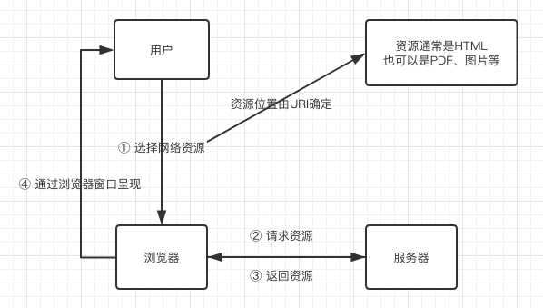
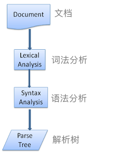
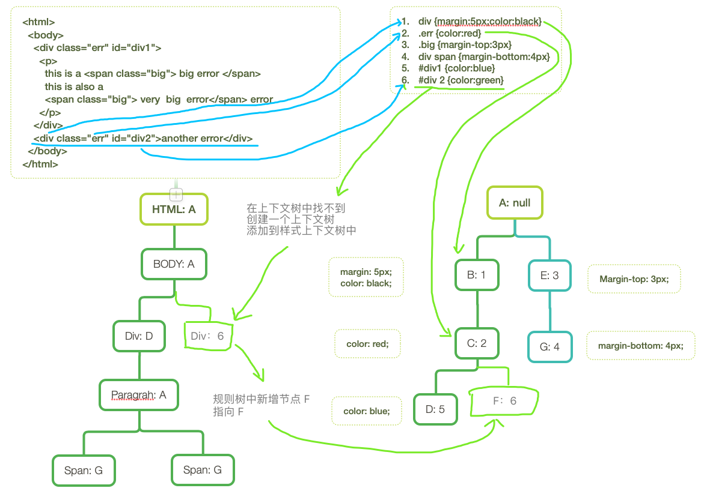

# 浏览器工作原理（学习笔记）

## 1. 介绍

### 1.1 示例浏览器

主流浏览器：Internet Explorer, Firefox, Safari, Chrome and Opera

示例浏览器：Firefox、Chrome（开源）和 Safari（部分开源）

[浏览器使用统计](http://gs.statcounter.com/)


### 1.2 浏览器的主要功能（The browser's main functionality）



浏览器的用户界面：

- 输入 URI 的地址栏
- 回退、前进按钮
- 网址收藏
- 刷新和停止按钮
- 首页按钮

HTML5 规范列出了浏览器的几种通用元素：

- 地址栏
- 状态栏
- 工具栏

### 1.3 浏览器的高层架构（The browser's high level structure）

浏览器的组成部分：

- 用户界面 
  > 包含地址栏、回退和前进按钮、网址收藏等。除了展示请求到的资源的主窗口，其他都是用户界面。
- 浏览器引擎  
  > 请求和操作渲染引擎的接口
- 渲染引擎   
  > 负责展示请求的资源。比如说，请求到的资源是 HTML，渲染引擎就负责解析 HTML 和 CSS，然后将解析后的内容展示在屏幕上。
- 网络      
  > 网络调用，如 HTTP 请求。它有跨平台的独立接口，且每个平台都有自己的底层实现方式。
- 用户界面后端  
  > 绘制基本的窗体小部件，如组合框、视窗。它显示一个非平台特定的泛型界面。在底层，它使用操作系统的用户界面方法。
- JS 解析器   
  > 解析和执行 JS 代码
- 数据存储
  > 持久层。浏览器需要它来存储硬盘上的各种数据，如 cookies。新的 HTML 规范（HTML5）定义了 *网页数据库* —— 浏览器中的完整（轻量）的数据库。
  


*浏览器主要组成部分示意图*

值得注意的是，chrome 浏览器有多个渲染引擎实例——每个 tab 标签页一个。每个 tab 标签页都是一个独立的进程。

## 2. 渲染引擎

### 2.1 渲染引擎（The rendering engine）

渲染引擎负责渲染，将请求到的内容呈现到屏幕上。

默认情况下，渲染引擎可显示 HTML、XML文档和图片。也可通过插件（浏览器扩展程序）显示其他类型。比如，可通过 PDF 阅读器插件显示 PDF 文件。

### 2.2 主流程（The main flow）

渲染引擎一开始从网络层请求文档内容。

接下来是以下的基本流程：


渲染引擎先解析 HTML，将标签转换成树的节点——叫作"内容树"。然后解析样式数据，包括外联样式和内联样式。样式信息和 HTML 中的可视指令一起用于创建另一棵树——渲染树。

渲染树包含具有可视属性（如颜色和尺寸）的矩形。矩形按正确的顺序显示在屏幕上。

渲染树构建完成后，就进入"布局"流程。也就是给每个节点分配正确的坐标——节点应该显示在屏幕上的哪个位置。下一步就是绘制——将遍历渲染树，通过用户界面（UI）后端层绘制每个节点。

重要的是要理解这是一个循序渐进的过程。为了更好的用户体验，渲染引擎将尽可能快地在屏幕上呈现内容。它不会等到所有的 HTML 都解析完成才开始构建和布局渲染树。当程序还在持续处理来自网络层的内容时，它已经解析和呈现了部分内容。

### 2.3 主流程示例（Main flow examples）


*Webkit 主流程*


*Mozilla Gecko 渲染引擎主流程*

### 2.4 解析和 DOM 树构建（Parsing and DOM tree construction）

#### 2.4.1 解析（Parsing-General）

由于解析是渲染引擎中非常重要的一个进程，所以我们会稍微深入讲一下。首先介绍下解析。

解析文档就是将文档转换成某种有意义的——对代码来说可以理解和使用的——结构。解析的结果通常是代表文档结构的节点树。通常叫作解析树或语法树。

例如，解析 2 + 3 - 1，将返回如下树：


*数学表达式树节点*

##### 2.4.1.1 语法（Grammars）

解析基于文档所遵循的语法规则——编写它的语言或形式。每种可编译的形式必须包含确定的语法——由词汇和语法规则组成。这叫作 __上下文无关语法__。人类语言并不是这样的，所以不能通过传统的解析技术来解析。

##### 2.4.1.2 词法分析器（Parser-Lexer combination）

解析可分为两个子进程——词法分析和语法分析。

词法分析就是将输入内容分解成词法单元的过程。词法单元就是语言词汇——有效构建块的集合。在人类语言中，词法单元由那种语言的词典中出现的单词所组成。

语法分析就是语言的语法规则的应用。

解析器通常将工作分配给两个不同的部件——词法分析器（有时也叫分词器），负责将输入内容分解成有效的词法单元；解析器，负责根据语法规则分析文档结构来构建解析树，

词法分析器知道如何丢弃无关的字符，如空格和换行。



*从源文档到解析树的过程*

解析的过程是不断重复的。解析器通常会向词法分析器查询一个新的词法单元，然后将这个词法单元与语法规则匹配，如果匹配到了，就将与这个词法单元对应的节点添加到解析树，然后继续查询下一个词法单元。

如果匹配不到，解析器会将这个词法单元储存起来，继续查询其他词法单元，直到找到一个能匹配所有储存起来的词法单元的语法规则为止。如果找不到匹配规则，解析器将抛出异常。这就是说文档是无效的，且包含了语法错误。

##### 2.4.1.3 翻译（Translation）

很多时候，解析树并不是最终的产物。解析通常用于翻译——将输入文档转换成另一种形式。比如说编译。编译器——将源代码转换成及其代码——首先会将它转换成解析树，然后再将解析树翻译成机器代码文档。


*编译流程*

##### 2.4.1.4 解析举例（Parsing example）

在 *数学表达式树节点* 图中，已经通过数学表达式构建过一个解析树。现在定义一个简单的数学语言，然后看一下解析过程。

词汇：这个语言可以包含整数、加号和减号。

语法：

> 1. 语法构建块是表达式、术语、操作。
> 2. 这个语言可包含任何数量的表达式。
> 3. 一个表达式被定义为：一个术语后面跟着一个操作，操作后面跟着另一个术语。
> 4. 一个操作就是一个加号或一个减号
> 5. 一个术语是一个整数或一个表达式。

现在来分析下 "2 + 3 - 1"。

第一个匹配到规则的子串是 "2"，根据规则 5，它是一个术语。
第二个匹配到的是 "2 + 3"，匹配到第二条规则——一个术语后面跟着一个操作，操作后面跟着另一个术语。
下一个匹配只能是末尾了。"2 + 3 - 1" 是一个表达式，因为我们已经知道 ?2+3? 是一个术语，所以我们有一个术语后面跟着一个操作，后面跟着另一个术语。
"2 + +" 不能匹配任何规则，所以是无效的输入。

##### 2.4.1.5 词汇和语法的正式定义（Formal definitions for vocabulary and syntax）

词汇通常由[正则表达式](https://www.regular-expressions.info/)表示。

比如，上面的语言可以这样定义：

<pre>
整数（INTEGER） : 0|[1-9][0-9]*  
加法（PLUS）    : +  
减法（MINUS）   : -  
</pre>

可以看到，整数是由正则表达式来表示的。

语法通常用一种叫做 [BNF](https://en.wikipedia.org/wiki/Backus%E2%80%93Naur_form) 的形式来定义。上面的语言可以这样定义：

<pre>
表达式（expression） :=  术语（term）     操作（operation）    术语（term）
操作（operation）    :=  加法（PLUS）   | 减法（MINUS）
术语（term）         :=  整数（INTEGER）| 表达式（expression）
</pre>

我们说过，如果一种语言的语法是上下文无关的，就能被常规解析器解析。

上下文无关语法的一种直观定义就是能完全用 BNF 形式表示。

上下文无关语法的正式定义可参考：http://en.wikipedia.org/wiki/Context-free_grammar

##### 2.4.1.6 解析器种类（Types of parsers）

解析器有两种基本类型——自上而下的解析器和自下而上的解析器。

直接的解释就是：自上而下的解析器查找语法的高层结构，然后尝试匹配其中的一个。自下而上的解析器从输入开始，然后逐步地转换成语法规则，从低级规则开始，直到匹配到高级规则为止。

现在来看下这两种解析器如何解析我们的示例。

自上而下的解析器从高级规则开始，它将 "2 + 3" 定义成一个表达式，然后将 "2 + 3 - 1" 定义成一个表达式（表达式定义的过程逐步演化成匹配其他规则，但是起点是高级规则）。

自下而上的解析器会扫描输入内容，直到找到匹配的规则，然后用这个规则去替换匹配的内容。这个过程将一直持续到输入内容的末尾。部分匹配的表达式储存在解析的堆内存中。


自下而上的解析器也叫作移位解析器。因为输入内容被移到右边（想象一个指示器从输入内容开始不断移到末尾），然后逐渐地变成语法规则。

##### 2.4.1.7 自动化解析器（Generating parsers automatically）

有些工具可以自动生成解析器，叫作解析器生成器。给解析器生成器提供语言的语法——词汇和语法规则——它就能生成一个工作解析器。

创建解析器需要深入理解解析，而且手动创建一个优化的解析器也非常不易，所以解析器生成器就非常有用了。

Webkit 使用两种众所周知的解析器生成器——Flex，用于创建分词器；Bison，用于创建解析器（有时候也可能叫做 Lex 和 Yacc）。

Flex 输入是一个包含用正则表达式定义标记的文件。Bison 输入是语言的语法规则和 BNF 形式。

#### 2.4.2 HTML 解析器（HTML Parser）

HTML 解析器负责将 HTML 标记解析成解析树。

##### 2.4.2.1 HTML 语法定义（The HTML grammar definition）

HTML 的词汇和语法规则由 W3C 组织的规范所定义。

##### 2.4.2.2 非上下文无关语法（Not a context free grammar）

在介绍解析时，提到了语法能通过 BNF 的形式定义。

然而，所有的传统解析器都不适用于 HTML。HTML 不能轻易地由解析器所需的上下文无关语法定义。

定义 HTML 语法有正式的形式——DTD（Document Type Definition 文档类型声明）。但是它不是一种上下文无关语法。

初看之下这非常得奇怪。HTML 非常接近于 XML。有许多的 XML 解析器。还有一种 HTML 的变种——XHTML。所以差异在哪里？

差异在于，HTML 非常的"宽容"，它允许你省略隐式添加的标签，有时还能省略开始或结束的标签。基本上，它是一种"软"语法，相反于 XML 的严格高要求的语法。

表面上看起来是很小的差异，然而却是天差地别。

一方面，这也是为什么 HTML 如此受欢迎——它会原谅你的错误，使网站作者感到更加舒适。另一方面，这使得写正式语法非常得困难。

总得来说，HTML 不能轻易地被传统解析器解析，因为它的语法不是上下文无关语法，也不能被 XML 解析器解析。

##### 2.4.2.3 HTML 文档类型声明（HTML DTD）

HTML 是用 DTD 形式定义的。这种形式用来定义 [SGML](https://en.wikipedia.org/wiki/Standard_Generalized_Markup_Language) （标准通用标记语言）语言。
这种形式包含了所有允许的元素的定义，它们的属性和层级。之前已经看到，HTML 文档类型声明不会形成上下午无关语法。

DTD 有很多不同的类型。严格模式是唯一符合规范的，其他形式还包含了对浏览器过去使用的一些标签的支持。目的是向后兼容旧的内容。

##### 2.4.2.4 DOM（文档对象模型）

输出树——解析树，就是 DOM 元素和属性节点的树。DOM 是 Document Object Model 的缩写。DOM 是 HTML 文档的对象呈现，也是 HTML 元素与外界（如 JavaScript）的连接接口。

树的根节点是 [Document](https://www.w3.org/TR/1998/REC-DOM-Level-1-19981001/level-one-core.html#i-Document)（文档）。

DOM 和 标记有着几乎一对一的关系。例如：

```html
<html>
  <body>
    <p>Hello World.</p>
    <div></div>
  </body>
</html>
```

上面内容会被转换成：


像 HTML 一样，DOM 由 W3C 组织规定。

##### 2.4.2.5 解析算法（The parsing algorithm）

如之前所说，HTML 不能被常规的自上而下或自下而上的解析器解析。

原因如下：

- 语言的宽容特性
- 浏览器具有传统的容错能力，以支持众所周知的无效 HTML 案例。
- 解析过程是可重入的。通常，在解析过程中，源是不会改变的，但是在 HTML 中，脚本元素包含 "document.write" 可以增加额外的标签，所以解析过程实际改变了输入的内容。

不能使用传统的解析技术，浏览器创建了自定义的解析 HTML 的解析器。

解析算法由 HTML5 规范详细描述。算法包含了两个阶段——分词和树的构建。

分词就是词法分析，将输入解析成标记。在 HTML 中，标记就是开始标签、结束标签、属性名称和属性值。

分词器识别标记，把它给到树构建器，然后继续查找下一个字符，识别下一个标记，直到输入的结束。


*HTML 解析流程*

##### 2.4.2.6 分词算法（The tokenization algorithm）

这个算法的输出是一个 HTML 标记。这个算法表现为一个状态机。每个状态消耗输入了的一个或多个字符，然后根据这些字符更新下一个状态。

这个决定受分词状态和树的构建状态所影响。这个算法太复杂，所以不能详细讲解，我们来看一个简单的例子，大致地了解下。

分词下面的 HTML：

```html
<html>
  <body>
    Hello world.
  </body>
</html>
```

初始的状态是 "数据状态"。当遇到 "<" 字符时，状态就变成 "标签打开状态"。遇到 "a-z" 字符时，会创建 "开始标签标记"，状态就变成 "标签名称状态"。
直到遇到 ">" 这个字符时，这个状态才会结束。每个字符都被添加到这个标记名称下。在我们的例子中，创建的标记就是 "html"。

当遇到 ">" 时，当前的标记会被释放，然后状态变回 "数据状态"。"<body>" 标签也用相同的步骤来解析。现在，"html" 和 "body" 标记都已被释放，状态变回 "数据状态"。
遇到 "Hello world." 的 "H" 时，会创建和释放一个字符标记。这个过程持续到遇到 "</body>" 的 "<" 字符为止，此时会释放 "Hello world." 的所有字符。

现在又回到了 "标签打开状态"。遇到 "/" 时会创建 "结束标签标记"，然后变成 "标签名称状态"。同样的，这个状态持续到遇到 ">" 这个字符为止。
然后这个新的标签标记会放释放，再次回到 "数据状态"。"</html>" 标签也会用同样的方式解析。


##### 2.4.2.7 树的构建算法（Tree construction algorithm）

当解析器创建好时，文档对象也创建好了。在树的构建阶段，会改变包含 Document 根节点的 DOM 树，还会添加元素到 DOM 树。每个被分词器释放的节点都将被树构建器加工。
对于每个标记，规范会定义与它相对应的 DOM 元素，并且为该元素创建这个元素。除了将元素添加到 DOM 树中外，还会将元素添加到一个开放元素的堆中。这个堆用于修正嵌套错误和未关闭的元素。
构建算法也是通过状态机的形式表示的。这些状态叫作"嵌入模式"。

来看一个树构建的过程：

```html
<html>
  <body>
    Hello world.
  </body>
</html>
```

树构建阶段的输入是一系列来自分词阶段的标记。第一个模式是 "初始模式"（initial mode）。接收 html 标记时，模式会转变成 "html 前"（before html）模式，并会对这个模式下的标记进行回收。
此时，会创建 HTMLHtmlElement 元素，并添加到 根文档对象（root Document object） 中。

之后又会转变成 "head 前"（before head） 状态。当遇到 "body" 标记时，HTMLHeadElement 元素会被隐式地创建，并被添加到 DOM 树，虽然我们没有 "head" 这个标记。

现在我们已经到了 "head 前" 模式，然后要进入到 "head 后"（after head） 模式。
现在对body 标记进行再加工，创建和插入 HTMLBodyElement 元素，此时又转变成了 "body 内"（in body）模式。
现在接收 "Hello world." 这个字符串字符标记，第一个字母会使构建器创建和插入一个 文本节点（Text node），其余的字符会被添加到这个节点中。

接收 body 的结束标记时，会转变成 "body 后" （after body）模式。 之后会接收 html 的结束标记，此时会转变成 "body 后后"（after after body） 模式。
接收到文件的结束标记时，解析也就结束了。


*html 的树构建*

##### 2.4.2.8 解析结束的操作（Actions when the parsing is finished）

在这个阶段，浏览器会标记文档是可交互的，然后开始解析"延迟"模式（deferred mode）下的脚本——在文档解析完成后执行。此时，文档状态变成 "完成"，抛出一个 "load" 事件。

关于完整的 HTML5 规范的分词和树构建的算法，可参考：http://www.w3.org/TR/html5/syntax.html#html-parser

##### 2.4.2.9 浏览器容错（Browsers error tolerance）

在 HTML 页面上，永远不会出现 "无效语法"（Invalid Syntax）的错误。浏览器会修正它，然后继续运行。

比如下面这段 HTML 代码：

```html
<html>
  <mytag>
  </mytag>
  <div>
  <p>
  </div>
    Really lousy html.
  </p>
</html>
```

我肯定已经违反了大概100万条规则（"mytag" 不是一个标准的标签，错误的 "div" 和 "p" 元素嵌套等），但是浏览器仍然正确的显示，没有任何抱怨。所以许多的解析器代码都在修正 HTML 作者的错误。

不同浏览器的错误处理出奇得相当一致，虽然现有的 HTML 规范并未对此有规定。像书签、前进/后退按钮，就是浏览器多年发展以来的产物。

有许多周知的无效代码结构，它们在许多网站不断重复，浏览器会尝试用与其他浏览器一致的方式修正它们。

HTML5 规范确实也有定义其中的一些要求。Webkit 在 HTML 解析器种类（HTML parser class）的开头的注释中，很好地总结了这些规范：

> 解析器将分词的输入解析成文档，构建文档树。如果这个文档结构良好，那么解析文档是很简单的。然而，我们不得不处理许多结构不是很好的文档，所以解析器不得不容错。
> 我们得至少注意以下这些错误条件：
>
> - 1、明确禁止在外部标签中添加的元素  
> 在这种情况下，我们应该闭合这些禁止添加元素的标签，然后再添加。
> - 2、不允许直接添加元素  
> 这可能是这样的，写文档的人忘记了一些中间的标签（或者这些中间标签是可选的）。  
> 这些标签可能是：HTML BODY TBODY TR TD LI （还有吗？）
> - 3、将块级元素嵌套在行内元素中。闭合所有的块级元素旁的行内元素。
> - 4、如果上面的都没用，闭合所有的元素，除非允许添加元素和忽略标签。

现在来看一些 Webkit 容错的例子：

__使用 \<\/br\> 代替 \<br\>__

有些网站使用 \<\/br\> 代替 \<br\>，为了兼容 IE 和 火狐，Webkit 会像下面这样对待它：

```
if (t->isCloseTag(brTag) && m_document->inCompatMode()) {
  reportError(MalformedBRError);
  t->beginTag = true;
}
```

> 注意：这些错误处理是在内部进行的，不会对用户显示。

__混乱的表格__

混乱的表格，就是一个表格嵌套在另一个表格中，但是没有嵌套在表格的单元格中。

例如：

```html
<table>
  <table>
    <tr>
      <td>inner table</td>
    </tr>
  </table>
  <tr>
    <td>outer table</td>
  </tr>
</table>
```

Webkit 会将这个层级变成两个兄弟表格。

```html
<table>
  <tr>
    <td>outer table</td>
  </tr>
</table>
<table>
  <tr>
    <td>inner table</td>
  </tr>
</table>
```

代码如下：

```
if (m_inStrayTableContent && localName == tableTag)
  popBlock(tableTag);
```

Webkit 将当前元素内容存在堆中，它会将内部的表格从外部的表格中推出。现在两个表格变成了兄弟表格。

__嵌套表单元素__

如果用户将一个表单嵌套在另一个表单中，第二个表单会被忽略掉。

代码：

```
if (!m_currentFormElement) {
  m_currentFormElement = new HTMLFormElement(formTag, m_document);
}
```

__很深的标签层级__

看下面的注释，不言而喻：

```
// www.liceo.edu.mx 这个网站将近有 1500 个标签嵌套，大多是一连串的 <b> 标签嵌套。
// 我们只允许最多 20 个相同类型的标签嵌套，其他的会被忽略。

bool HTMLParser::allowNestedRedundantTag(const AtomicString& tagName)
{
  unsigned i = 0;
  for (HTMLStackElem * curr = m_blockStack;
     i < cMaxRedundantTagDepth && curr && curr -> tagName == tagName;
  curr = curr->next, i++) { }
  return i != cMaxRedundantTagDepth;
}
```

__html 或 body 闭合标签的位置放错__

再来看一下它的注释：

> 支持破碎的 html
> 我们不会闭合 body 标签，因为一些愚蠢的网页会在文档结束时闭合它。
> 我们依靠 end() 方法来闭合。

```
if (t->tagName == htmlTag || t->tagName == bodyTag )
  return;
```

所有网页开发者要注意了，除非你想你的代码出现在 Webkit 容错示例中，否则就写结构良好的文档。

#### 2.4.3 CSS 解析（CSS parsing）

还记得什么是解析的概念吗？不像 HTML，CSS 是上下文无关语法，可以通过之前介绍的解析器解析。
事实上，CSS 的词法语法和句法语法由 CSS 规范规定，参考：https://www.w3.org/TR/CSS2/grammar.html

来看一些例子：

词法语法（词汇）是通过正则来定义每个标记的。

```
comment		\/\*[^*]*\*+([^/*][^*]*\*+)*\/
num		[0-9]+|[0-9]*"."[0-9]+ // 匹配 num，不知道为什么要加 "."
nonascii	[\200-\377]
nmstart		[_a-z]|{nonascii}|{escape}
nmchar		[_a-z0-9-]|{nonascii}|{escape}
name		{nmchar}+
ident		{nmstart}{nmchar}*
```

"ident" 是 "identity" 的缩写，比如一个类名（class name）。 "name" 是一个元素 id（由 # 来引用）。

句法语法由 BNF 来描述。

```
ruleset
  : selector [ ',' S* selector ]*
    '{' S* declaration [ ';' S* declaration ]* '}' S*
  ;
selector
  : simple_selector [ combinator selector | S+ [ combinator selector ] ]
  ;
simple_selector
  : element_name [ HASH | class | attrib | pseudo ]*
  | [ HASH | class | attrib | pseudo ]+
  ;
class
  : '.' IDENT
  ;
element_name
  : IDENT | '*'
  ;
attrib
  : '[' S* IDENT S* [ [ '=' | INCLUDES | DASHMATCH ] S*
    [ IDENT | STRING ] S* ] ']'
  ;
pseudo
  : ':' [ IDENT | FUNCTION S* [IDENT S*] ')' ]
  ;
```

解释：ruleset 的结构如下：

```
div.error, a.error {
  color:red;
  font-weight:bold;
}
```

div.error 和 a.error 是选择器。大括号内的内容会应用到这个 ruleset 上。这个结构会用下面的方式定义：

```
ruleset
  : selector [ ',' S* selector ]*
    '{' S* declaration [ ';' S* declaration ]* '}' S*
  ;
```

这就是说，一个 ruleset 就是一个选择器或者多个由逗号和空格分隔的选择器（S 代表空格）。一个 ruleset 包含一个大括号，以及括号内的一个或多个由分号分隔的声明。
"声明"（declaration）和 "选择器"（selector）由下面的 BNF 定义。

##### 2.4.3.1 Webkit CSS 解析器（Webkit CSS parser）

Webkit 使用 [Flex 和 Bison](http://taligarsiel.com/Projects/howbrowserswork1.htm#parser_generators) 解析器生成器从 CSS 语法文件中自动生成解析器。

回忆一下上面对解析器的介绍一节，Bison 创建一个自下而上的移位递减解析器。

Firefox 使用手写的自上而下的解析器。

在两种情况下，CSS 文件都会被解析成 样式表（StyleSheet）对象，每个对象包含 CSS 规则。每个 CSS 规则包含选择器、声明对象和其他与 CSS 语法相对应的对象。


*解析 CSS*

#### 2.4.4 解析脚本（Parsing scripts）

本章主要会通过 JavaScript 来讲解。

#### 2.4.5 处理脚本和样式表的顺序（The order of processing scripts and style sheets）

##### 2.4.5.1 脚本（Scripts）

网络模型是同步的。作者们都希望解析器遇到 \<script\> 标签时能立即解析和执行。文档解析会处于被阻塞状态，直到脚本执行完毕。

如果是外部脚本，那么先得从网上获取资源——这也是同步的，文档解析会处于被阻塞状态，直到资源获取完毕。

多年来，一直都是这种模型，也是 HTML4 和 HTML5 规范规定的模型。作者可以将脚本标记为"延迟"（defer），这样不会阻塞文档的解析，解析完成后，就会执行。
HTML5 增加了一个选项，可以把脚本标记成异步的，这样就可以在另一个线程中进行解析和执行。

##### 2.4.5.2 预解析（Speculative parsing）

Webkit 和 Firefox 都做了这种优化。在执行脚本的过程中，另一个线程解析文档的剩余部分，找出还需要从网上加载哪些资源，然后加载它们。
这样，资源可以平行加载，总体速度也会更快。

> 注意：预解析器不会改变 DOM 树，DOM 树还是会留给主解析器，它只会解析外部资源的引用，如外部脚本、样式和图片等。

##### 2.4.5.3 样式表（Style sheets）

样式表有着不同的模型。概念上，看起来样式表不会变成 DOM 树，所以没必要等待和阻塞文档解析。
但是，在文档解析阶段，脚本会向样式信息问一个问题。如果样式还没加载和解析，脚本会得到错误的答案，显然，这会导致很多的问题。
这似乎是一个边界情况，但是却相当普遍。

当有样式在加载和解析时，Firefox 会阻塞所有的脚本。Webkit 仅会阻塞这些试图获取特定的样式属性——这些属性可能会受未加载的样式影响——的脚本。

### 2.5 渲染树构建（Render tree construction）

构建 DOM 树的同时，浏览器还在构建另一个树——渲染树。渲染树由可视元素组成，这些元素按将要展示的顺序排列。它是文档的视觉呈现。
渲染树的目的是保证内容有序绘制。

Firefox 把渲染树中的元素叫作 "帧"（frames）。

Webkit 把这些元素叫作 "渲染器"（renderer）或 "渲染对象"（render object）。

一个渲染器知道如何布局和绘制自身及其子类。

Webkit 的渲染器对象的基本类—— RenderObject 类的定义如下：

```
class RenderObject{
  virtual void layout();
  virtual void paint(PaintInfo);
  virtual void rect repaintRect();
  Node* node;  // the DOM node
  RenderStyle* style;  // the computed style
  RenderLayer* containgLayer; // the containing z-index layer
}
```

每个渲染器代表了一个矩形区域，与 CSS2 规范定义的节点的 CSS 盒子（盒模型）相对应。它包含了几何信息，如宽、高和位置。

盒子的类型由与节点相对应的 "display" 样式属性决定。

下面的是 Webkit 的代码，通过 "display" 属性决定应该为 DOM 节点生成何种渲染器。

```
RenderObject* RenderObject::createObject(Node* node, RenderStyle* style)
{
  Document* doc = node->document();
  RenderArena* arena = doc->renderArena();
  ...
  RenderObject* o = 0;

  switch (style->display()) {
    case NONE:
      break;
    case INLINE:
      o = new (arena) RenderInline(node);
      break;
    case BLOCK:
      o = new (arena) RenderBlock(node);
      break;
    case INLINE_BLOCK:
      o = new (arena) RenderBlock(node);
      break;
    case LIST_ITEM:
      o = new (arena) RenderListItem(node);
      break;
   ...
  }

  return o;
}
```

还考虑了元素类型，如表单控件和表格有特殊的帧。

在 Webkit 中，如果一个元素想创建一个特殊的渲染器，那么它会覆写 createRenderer 这个方法。这些渲染器指向包含了非几何信息的样式对象。

#### 2.5.1 渲染树与 DOM 树的关系（The render tree relation to the DOM tree）

渲染器与 DOM 元素相对应，但并不是一对一的关系。非可视元素不会被插入到渲染树，比如 head 元素。
还有 display 属性设置为 none 的元素也不会出现在渲染树中（visibility 设置为 hidden 的元素会出现在渲染树中）。

有些 DOM 元素会对应多个可视对象。有些元素结构比较复杂，所以不能用单个矩形来表示。比如，select 元素有3个渲染器，一个渲染区域，一个渲染下拉列表框，一个渲染按钮。
当文本在一行内显示不下，被拆分成多行时，新行中的文本会被添加到新的渲染器中。

另一个多个渲染器的例子是拆分的 HTML。CSS 规范规定一个行内元素只能包含块级元素或只能包含行内元素。
如果行内元素既包含了行内元素又包含了块级元素，会创建一个匿名块级渲染器包裹这些行内元素。

有些渲染对象与 DOM 节点一对一对应，但是在树中的位置却不同。浮动和绝对定位的元素脱离了流，放置在树的不同位置，然后映射到实际的帧。它们存在于占位符帧中。


*渲染树和与之对应的 DOM 树，Viewport 是初始的包含块。在 Webkit中，Viewport 是 RenderView 对象。*

#### 2.5.2 构建树的过程（The flow of constructing the tree）

在 Firefox 中，构建过程表现为为 DOM 的更新注册一个监听器（listener），然后将帧的创建委派给 "帧构建器"，构建器会分解样式（见下面的[样式计算](#2.5.3-样式计算)），创建帧。

在 Webkit 中，分解样式和创建渲染器的过程叫作 "附着"（attachment）。每个 DOM 节点都有一个 attach 方法。"附着" 是同步的，节点插入到 DOM 树中会调用新节点的 attach 方法。

渲染树根节点构建时会处理 html 和 body 标签。根渲染对象与 CSS 规范中的包含块——最顶端的包含所有其他块的块——相对应。
包含块的大小就是视口大小——浏览器窗口展示的区域大小。Firefox 把它叫做 "视口帧"（ViewPortFrame），Webkit 把它叫做 "RenderView"（渲染视口）。
这就是文档指向的渲染对象。树的其他部分被构建为 DOM 节点插入。

CSS2 关于这个话题的的资料： http://www.w3.org/TR/CSS21/intro.html#processing-model

#### 2.5.3 样式计算（Style Computation）

构建渲染树需要计算每个渲染对象的可视属性。通过计算每个元素的样式属性来完成。

样式包含了不同来源的样式表，如内联样式元素、HTML 中的可视属性（比如 bgcolor 属性）。后者被转换，匹配 CSS 的样式属性。

样式表来源于浏览器的默认样式表、网页作者提供的样式表、用户样式表——这些样式表由浏览器用户提供（浏览器允许用户定制喜欢的风格，比如，在 Firefox 中，可以在 Firefox fold 中放置一份样式表即可）。

样式计算带来了一些难题

- 1、样式数据的结构庞大，包含了许多的样式属性，可能会引起内存问题。
- 2、如果没有优化，那么为每个元素查找匹配规则会导致性能问题。为每个元素查找匹配遍历整个规则表是一项繁重的任务。
选择器可以有复杂的结构，这会导致匹配过程会从看上去有希望的路径开始匹配，而实际上却是无效的，然后再去尝试新的匹配路径。
- 3、应用规则涉及非常复杂的级联规则，这些规则定义了规则的层次结构。

比如下面的复合选择器：

```css
div div div div{
  // ...
}
```

上面的代码意思就是匹配一个 \<div>，它是三个 \<div> 的后代。
假如你想验证这个匹配规则是否适用于某个 \<div> 元素，你从树上选某个路径开始验证，你需要遍历节点树去找到三个 \<div>，结果却只找到两个，匹配规则并不生效。
你就得从节点树的另一个路径开始查找。

- 应用规则涉及非常复杂的级联规则，这些规则定义了规则的层次结构。

我们来看看浏览器怎么解决这些问题：

##### 2.5.3.1 共享样式数据（Sharing style data）

Webkit 节点引用样式对象（渲染样式 RenderStyle）。这些对象在某些情况下，可以被节点共享。这些节点是兄弟节点以及：

- 1、这些元素必须在相同的鼠标状态下（比如，不能一个是 :hover 状态，其他的不是）
- 2、元素不应该有 ID
- 3、标签名称应该能匹配
- 4、class 属性应该能匹配
- 5、映射属性集必须完全相同
- 6、link 状态必须匹配
- 7、focus 状态必须匹配
- 8、元素不能受到属性选择器的影响，影响被定义为可匹配到使用了元素中的任何属性的属性选择器。
- 9、元素不能存在行内样式属性
- 10、不能使用兄弟选择器。WebCore 遇到兄弟选择器时会抛出一个全局开关，为整个文档关闭样式共享。浙些选择器包括：+ 选择器，:first-child 和 :last-child 等。

##### 2.5.3.2 Firefox 规则树（Firefox rule tree）

为了更简单的样式计算，Firefox 提供了两种树——规则树和样式上下树。Webkit 也有样式对象，但是他们不是储存在类似于样式上下文树的树中，它只有 DOM 节点指向相应的样式。


*Firefox 样式上下文树*

样式上下文包含了端值（end values）。值的计算是通过按正确的顺序应用匹配规则，以及执行将它们从逻辑值转换成具体值的操作来完成的。
比如，如果逻辑值是屏幕的百分百，它会被计算并转换成绝对的单位。规则树的想法相当得聪明。它允许在不同节点间共享这些值，避免重复计算。同时也节省了空间。

所有匹配到的规则都会储存在树中，在一条路径中，越下面的节点拥有越高的优先级。样式上下文树包含了找到的规则匹配的所有路径。规则的储存是惰性的。
样式上下文树不会一开始就为每个节点进行计算，而是当节点需要被计算时，将计算路径添加到树中。

我们的想法是将树路径看成是词典中的单词。假设我们已经计算好了规则树：


假设，我们需要在内容树中为其他元素匹配规则，找到的规则（按正确的顺序）是：B - E - I。这个规则已经存在于树中，因为已经计算过 A - B - E - I - L 的路径。现在我们要做的工作就少了。

##### 2.5.3.2.1 分结构（Division into structs）

样式上下文被分成不同的结构。每个结构都包含了某种分类（如border或color）的样式信息。
结构中的所有属性（properties）或者是继承的或者是非继承的。继承属性除非在元素上有定义属性，一般会继承父级。
非继承属性（也叫重置属性）如果未定义，一般会使用默认的。

样式上下文树会帮忙将树中的结构缓存起来（包括计算的端值）。如果下层节点没有为结构提供定义，就用缓存中的上层节点的的结构。

##### 2.5.3.2.2 使用规则树计算样式上下文（Computing the style contexts using the rule tree）

为某个元素计算样式上下文时，首先会去计算规则树中的路径，或者使用已经存在的路径。然后在路径中应用规则填充新样式上下文中的结构。
我们从路径的底层节点——优先级最高的节点（通常是最具体的选择器）开始，然后往上遍历上下文树，直到将结构填充完成。
如果在规则树中没有对该结构的规定，那么我们就可以大幅优化——我们在树中往上找，找到某个节点能完整得规定并指向这个结构——这是最好的优化——因为这整个结构是完全共享的。
这样节省了端值的计算和内存。如果我们只找到部分定义，那么继续在树中往上找，直到将整个结构填充完整。

如果我们没有找到对该结构的任何定义，假如整个结构是一个"继承"类型，就将该结构指向上下文树的父级结构，在这种情况下，我们也成功共享了结构。
如果是重置结构，那么将使用默认值。

如果最具体的节点有添加值，那么我们需要进行额外的计算，将这些值转成实际的值，然后将结果储存在树节点中，供子节点使用。

假如一个元素有子节点或兄弟节点，它们指向相同的树节点，那么整个样式上下文（entire style context）可以在它们之间共享。

来看一个例子，

假设有这么一段 HTML 代码：

```html
<html>
  <body>
    <div class="err" id="div1">
      <p>
        this is a <span class="big"> big error </span>
        this is also a
        <span class="big"> very  big  error</span> error
      </p>
    </div>
    <div class="err" id="div2">another error</div>
  </body>
</html>
```

以及规则如下：

```
1.  div {
      margin: 5px;
      color: black;
    }
2.  .err {
      color: red;
    }
3.  .big {
      margin-top: 3px;
    }
4.  div span {
      margin-bottom: 4px;
    }
5.  #div1 {
      color: blue;
    }
6.  #div2 {
      color: green;
    }
```

简单来说，我们需要填充两种结构——颜色结构（color struct）和边缘空白结构（margin struct）。颜色只包含一个成员，而边缘包含了四个边。
规则树看起来如下（节点以节点名——即序号标记）和语法树如下（节点名，指向规则节点）：


*规则树（右侧）和上下文树（左侧）*

(感觉原文中的图有点问题，所以改了，如果改错了，请指正，谢谢！)

*上下文树*

假设我们现在解析这段 HTML 代码，遇到第二个 \<div> 标签，我们需要为这个节点创建一个样式上下文，然后填充它的样式结构。
匹配规则时，发现这个 \<div> 标签匹配到的规则是 1、2、6，这就是说，在树中已经存在当前元素可以使用的路径，现在仅需要将规则 6（规则树中的 F） 添加到另一个节点中。
然后创建一个样式上下文，将它存到上下文树中。新的样式上下文将指向规则树中的节点 F。可参考下图。



现在填充样式结构，从 margin 结构开始，因为最后一个规则节点（F）没有加到 margin 结构中，
我们可以在树中继续往上找，直到找到之前的节点插入时计算并储存起来的结构，并使用它。
最后在节点 B 中找到——规定了 margin 规则的最上面的节点。

因为对颜色结构有定义，所以不能使用缓存的结构。因为颜色有一个属性，所以我们不需要在树中填充其他属性。我们将计算端值（end value）——将字符串转成 RGB 等——然后在这个节点中储存计算好的结构。

解析第二个 \<span> 元素的工作更加简单。我们匹配规则，发现它指向规则 G，和之前的 \<span> 一样。子节点指向了同一个节点，所以可以共享整个样式上下文，指向前一个 span 元素的上下文。

对于包含继承自父级规则的结构，是储存在上下文树中的（color 属性实际上继承的，但是 Firefox 把它当成重置属性，并缓存在规则树中）。

比如，我们给 paragraph 增加了 fonts 规则：

```css
p { font-family: Verdana; font-size: 10px; font-weight: bold; } 
```

上下文树中 p 元素的子级（child） —— div 元素就可以共享父级的相同 font 结构。前提是 div 元素没有规定 font 规则。

在 Webkit 中没有规则树，所以匹配声明会被遍历4次。

- 首先，重要的高优先级的规则。（这些规则优先应用，因为其他属性会依赖于它们，如 display）
- 其次，高优先级重要的规则。
- 然后，普通优先级不重要的规则。
- 最后，普通优先级重要的规则。

这就是说，多次出现的属性会根据正确的层级顺序进行解析，明显后者（上下文规则树）胜出。

总结一下，共享样式对象（全部或部分结构）解决了问题 [1](#样式计算带来了一些难题) 和 [3](#样式计算带来了一些难题)。Firefox 的规则树对于按正确顺序应用属性也很有帮助。

##### 2.5.3.3 操作规则以便轻松匹配（Manipulating the rules for an easy match）

样式规则的来源：

- CSS 规则，外部或内部样式表

```css
p { color: blue; } 
```

- 行内样式属性

```html
<p style="color: blue;"></p>
```

- HTML 视觉属性（映射到对应的样式规则）

```html
<p bgcolor="blue"></p>
```

后面两个很容易匹配到，因为它拥有样式属性和 HTML 属性，可以将元素当做 key 来进行映射。

正如之前提到过的问题 [2](#样式计算带来了一些难题)，css 规则匹配更加棘手。
为了解决这个问题，规则被改成更加容易访问。

解析完样式表后，根据选择器，将访问规则添加到其中的某个哈希映射中。
有ID映射，类名（class name） 映射，标签名（tag name）映射，和一个普通映射包含了其他不属于前面几种分类的选择器。
如果选择器是 id，就将规则添加到 ID 映射表中，如果是类名，就将规则添加到类名映射表中，以此类推。

这样的操作使得规则匹配更加容易。这样就没必要在每个声明中查找，能从映射表中提取出元素相对应的规则。

这个优化排除了 95% 以上的规则，甚至在匹配过程中都不需要考虑([4.1](http://taligarsiel.com/Projects/howbrowserswork1.htm#4_1))。

来看下面的样式规则：

```css
p.error {
  color: red;
}
#messageDiv {
  height:50px;
}
div {
  margin: 5px;
}
```

第一个规则将被插入到类名映射表中，第二个插入到ID映射表中，第三个插入到标签名映射表中。

继续看下面的 HTML 片段：

```html
<p class="error">an error occurred </p>
<div id=" messageDiv">this is a message</div>
```

先尝试为 p 元素找到规则，类名映射表中包含了名为 "error" 的 key，在该 key 下可以找到 "p.error" 的规则。
div 元素可以在 ID映射表（key 为 id）和标签名映射表中找到相应的规则。

所以现在唯一的工作就是，找出按 key 提取出的规则中哪些规则是真正匹配的。

比如，div 的规则是这样的：

```css
table div {
  margin: 5px;
}
```

现在仍是从 标签映射表 中提取，但是 key 是最右边的选择器，但是它不会匹配上面的 div，因为它没有 table 祖先。

对于上面的问题，Webkit 和 Firefox 都做了相应的操作（manipulation）。

##### 2.5.3.4 按正确的层级顺序应用规则（Applying the rules in the correct cascade order）

样式对象的属性与每个视觉属性相对应。如果某个属性没有被任何匹配的规则所定义，那么就可以从父级元素的样式对象上继承某些属性。其他的属性使用默认值。

当有多个定义时，问题就出现了——层级顺序就是为了解决这个问题的。

##### 2.5.3.4.1 样式表层叠顺序（Style sheet cascade order）

一个样式属性的声明可以在多个样式表中出现，也可在同个样式表中出现多次。这就意味着规则的应用顺序非常重要。这叫作 "层级" 顺序。
根据 CSS2 的规范，层级顺序如下（从低到高）：

- 浏览器声明（Browser declarations）
- 用户的标准声明（User normal declarations）
- 作者的标准声明（Author normal declarations）
- 作者的重要声明（Author important declarations）
- 用户的重要声明（User important declarations）

浏览器声明是最不重要的，用户声明仅在设为重要（important）时才会覆盖作者的声明。
顺序相同的声明会根据指定的顺序来分类，然后按指定的顺序来排序。
HTML 视觉属性会被翻译并匹配 CSS 的声明。这些被认为是低优先级的用户规则。

##### 2.5.3.4.2 指定顺序（Specifity）

选择器顺序指定由 CSS2 规范规定，具体如下：

- 如果声明是来自 "style" 属性，而不是来自选择器规则，就加1，否则就加0（=a）
- 累加选择器中 ID 属性的数量（=b）
- 累加选择器中的其他属性和伪类的数量（=c）
- 累加选择器中的元素名和伪元素的数量（=d）

连接数字 a-b-c-d （在一个大型的数字系统中）算出指定顺序。

需要用到的基数由以上四个类型中数字最大的来决定。

比如说，a = 14，那么可以使用十六进制。当 a = 17时，需要一个17位数的基数。
后者发生的情况是有一个类似于这样的选择器：html body div div p ... (选择器中有17个标签，虽然可能性不是很大)。

一些示例：

```
 *             {}  /* a=0 b=0 c=0 d=0 -> specificity = 0,0,0,0 */
 li            {}  /* a=0 b=0 c=0 d=1 -> specificity = 0,0,0,1 */
 li:first-line {}  /* a=0 b=0 c=0 d=2 -> specificity = 0,0,0,2 */
 ul li         {}  /* a=0 b=0 c=0 d=2 -> specificity = 0,0,0,2 */
 ul ol+li      {}  /* a=0 b=0 c=0 d=3 -> specificity = 0,0,0,3 */
 h1 + *[rel=up]{}  /* a=0 b=0 c=1 d=1 -> specificity = 0,0,1,1 */
 ul ol li.red  {}  /* a=0 b=0 c=1 d=3 -> specificity = 0,0,1,3 */
 li.red.level  {}  /* a=0 b=0 c=2 d=1 -> specificity = 0,0,2,1 */
 #x34y         {}  /* a=0 b=1 c=0 d=0 -> specificity = 0,1,0,0 */
 style=""          /* a=1 b=0 c=0 d=0 -> specificity = 1,0,0,0 */
 ```

##### 2.5.3.4.3 规则排序（Sorting the rules）

样式规则匹配完成后，会根据层级规则对其进行排序。
对于数据量小的列表，Webkit 使用冒泡排序（bubble sort），而对于数据量大的列表，使用混合排序（merge sort）。

Webkit 通过重写 “>” 操作符为下面的规则实现排序：

```
static bool operator >(CSSRuleData& r1, CSSRuleData& r2)
{
  int spec1 = r1.selector()->specificity();
  int spec2 = r2.selector()->specificity();
  return (spec1 == spec2) : r1.position() > r2.position() : spec1 > spec2; 
}
```

#### 2.5.4 渐进的过程（Gradual process）

Webkit 使用一个标志来标记顶层样式表是否加载完成（包括 @imports）。
当使用样式时，发现样式没有完全加载完成，将会使用占位符，并且在文档中进行标记，当样式加载完成时，会重新进行计算。

### 2.6 布局（Layout）

渲染器创建完成并被添加到渲染树时，它没有位置（position）和 大小（size）。

计算这些值的过程叫作 布局（layout）和 回流（reflow）。

HTML 使用基于流的布局模型，这意味着大多数时候能一次性计算出几何结构。
流后面的元素不会影响流前面的元素的几何结构。所以布局可以按从左到右、从上到下的顺序进行。
但也有例外——比如 tables，就需要多次计算（[3.5](http://taligarsiel.com/Projects/howbrowserswork1.htm#3_5)）

坐标系统和根框架相关，使用上侧和左侧坐标。

布局是一个递归的过程。从根渲染器开始，与 HTML 文档的元素相对应。布局会在其中一些或所有框架层级中持续递归，为每个渲染器计算几何信息。

根渲染器的位置是 0,0，它的大小是视口大小——浏览器窗口的可视部分。

所有的渲染器都有一个 layout（布局） 和 reflow（回流） 方法，每个渲染器都会调用那些需要布局的子渲染器的 layout 方法。

#### 2.6.1 脏值系统（Dirty bit system）

为了避免为每个小的变动都进行一次完整的布局，浏览器使用了脏值系统。

一个渲染器改变或添加了之后会标记自己及其子代为“dirty”——需要布局。

有两种标志——“dirty”和“children are dirty”。后者意味着虽然渲染器本身没问题，但是它至少有一个需要布局的子代。

#### 2.6.2 全局和递增布局（Global and incremental layout）

布局能在整个渲染树上触发——这就是全局布局（global layout）。以下几种情形会引起全局布局：

1、会影响到所有渲染器的全局样式改变，比如字体大小的改变。
2、屏幕大小调整。

布局可以是递增的，只有脏的渲染器会被布局（这可能会导致某些不好的影响，会引起额外的布局）。

渲染器脏了会就会（异步地）触发递增布局（incremental layout）。比如，当网络请求到新的内容，添加到 DOM 树后，就会有新的渲染器被添加到渲染树。


*递增布局——只有脏的渲染器及其子代会被布局*

#### 2.6.3 异步和同步布局（Asynchronous and Synchronous layout）

递增布局是异步完成的。Firefox 会为递增布局进行“回流请求”（reflow commands）排队，然后通过调度程序触发这些请求的批量执行。Webkit 也有一个执行递增布局的定时器——遍历渲染树，布局脏渲染器。

请求样式信息，如 “offsightHeight” 的脚本会触发同步递增布局。
全局布局通常都是同步触发的。

有时候初始布局后的回调也会触发布局，因为一些属性（比如滚动位置）发生改变。

#### 2.6.4 优化（Optimizations）

如果布局的触发是由于大小调整（resize）或者渲染器的位置（position）改变——而不是大小改变，渲染器的大小会从缓存中获取，不会重新计算。

在某些情况下，当只有子渲染树改变时，布局不会从根节点开始。发生这种情况的情形有：局部改变，不会影响周围——比如文本插入到文本域中。否则的话，每次按键都会触发从根节点开始的布局。

#### 2.6.5 布局过程（The layout process）

布局通常有下面几种模式：

1. 父渲染器决定自己的宽度
2. 父渲染器遍历子渲染器，然后
  1. 放置子渲染器（设置它的x和y）
  2. 如有需要，调用子渲染器的layout（布局）方法——它们是脏的或者我们在全局布局中，或者其他某些原因——这会计算子渲染器的高度。
3. 父渲染器使用子渲染器的高度、外边距、内边距的累加高度来设置自己的高度——父渲染器的父渲染器也会使用这个高度。
4. 设置脏值为false。

Firefox 使用状态（state）对象（nsHTMLReflowState）作为 layout 方法的参数（术语叫“reflow”）。其中包含了父渲染器的宽度。

Firefox layout 方法的输出是一个度量（metrics）对象（nsHTMLReflowMetrics）。它包含渲染器计算的高度。

#### 2.6.6 宽度计算（Width calculation）

渲染器的宽度是使用容器块的宽度——渲染器的样式 “width” 属性和 margins 和 borders 来计算的。

比如下面 div 的宽度：

```html
<div style="width: 30%"></div>
```

Webkit 的计算方式如下（RenderBox类，calcWidth方法）：

- 容器的宽度是容器可用宽度（availableWidth）和0的最大值。在上面这个例子中，可用宽度就是内容宽度（contentWidth），计算方式如下：

```js
clientWidth() - paddingLeft() - paddingRight()
```

clientWidth 和 clientHeight 指的是一个对象的内部宽高，除去边（border）和滚动条（scrollbar）。

- 元素的宽就是样式属性“width”的值，这个值是一个相对值，通过计算父容器的宽度的百分比得到。
- 然后添加横向边和内边距（horizontal borders and paddings）。

目前为止，这是“首选宽度”（preferred width）的计算，接下来计算最小宽度和最大宽度（minimum and maximum width）。如果首选宽度的值比最大宽度的值大，将使用最大宽度的值。如果首选宽度的值小于最小宽度的值（最小的不可分割的单位），将使用最小宽度的值。

这些值会缓存起来，以防在宽度没有改变的情况下需要重新布局。

#### 2.6.7 折行（Line Breaking）

在一个渲染器在布局过程中发现需要折行，它会停下来，通知父渲染器它需要折行。父渲染器就会创建额外的渲染器，然后调用这些渲染器的layout方法。

### 2.7 绘制（Painting）

在绘制阶段，会遍历渲染器树，调用渲染器的 paint 方法，在屏幕上排列内容。绘制使用 UI 基础组件，可以查看 UI 章节了解更多。

#### 2.7.1 全局和递增（Global and Incremental）

和布局（layout）一样，绘制也可以是全局的——整个树绘制，或递增绘制。在递增绘制时，有些渲染器会以某种方式改变，但不会影响整个树。改变了的渲染器会使自己在屏幕上的矩形位置无效。这会使得 OS 认为它是脏区域，然后生成一个 paint 事件。OS 巧妙地处理，然后将这些区域合并成一个。在 Chrome 中更加复杂，因为渲染器和主流程不在同一个进程中。Chrome 中某些程度上模仿了 OS。绘制过程（presentation）监听这些事件，并将信息传递给渲染根节点。它会遍历渲染树，直到找到相关的渲染器。它会重新绘制自己（通常也会重新绘制它的子级）。

#### 2.7.2 绘制顺序（The painting order）

CSS2 规定了绘制程序的顺序——[http://www.w3.org/TR/CSS21/zindex.html](http://www.w3.org/TR/CSS21/zindex.html)。这实际上就是元素在[层叠上下文（stacking context）](http://taligarsiel.com/Projects/howbrowserswork1.htm#stackingcontext)中如何层叠的顺序。

这个顺序影响了绘制，因为层叠是从后到前的顺序绘制的。一个块级渲染器的层叠顺序如下：

1. background color（背景颜色）
2. background image（背景图片）
3. border（边）
4. children（子级）
5. outline（轮廓）

#### 2.7.3 Firefox 排列列表（Firefox display list）

Firefox 遍历渲染树，然后为绘制的矩形创建一个排列列表。它包含了与矩形相对应的按正确绘制顺序（渲染器的 backgrounds，borders 等）排序的渲染器。

这样，渲染树只需要遍历一次，而不用遍历很多次——绘制所有的背景、所有的图片、所有的边等。

Firefox 对绘制过程做了优化：不添加看不见的元素，如完全位于不透明元素下面的元素。

#### 2.7.4 Webit 矩形存储（Webkit rectangle storage）

在重新绘制前，webkit 将老的矩形存储为位图，然后只绘制这些处于新老矩形之间的区域。

### 2.8 动态改变（Dynamic changes）

浏览器尝试对变化采取最小可能的行为。所以元素颜色的变化只会导致元素的重绘。元素位置的变化会导致元素及其子代或者同级元素的布局和重绘。增加 DOM 节点会导致节点的布局和重绘。重要的改变，如 html 元素的 font size，会导致缓存无效，然后触发整个树的重新布局和重绘。

### 2.9 渲染引擎线程（The rendering engine's threads）

渲染引擎是单线程。几乎所有的操作，除了网络操作，都是单线程。在 Firefox 和 Safari 中，这是浏览器的主线程。
在 Chrome 中，渲染引擎是 tab 进程的主线程。

网络操作可以以多个并行线程的方式执行。并行连接的个数有限制（通常是2-6个，Firefox3 使用 6个）。

#### 2.9.1 事件循环（Event loop）

浏览器的主线程是一个事件循环。它是使进程保持活跃的无限循环。它等待事件（比如 layout 和 repaint事件），然后处理它们。下面是 Firefox 主要事件循环的代码：

```
while (!mExiting)
    NS_ProcessNextEvent(thread);
```

### 2.10 CSS2 视觉模型（CSS2 visual model）

#### 2.10.1 画布（The canvas）

根据 [CSS2 规范](http://www.w3.org/TR/CSS21/intro.html#processing-model)，术语 canvas 就是 “渲染格式化的结构的空间”——浏览器绘制内容的地方。

根据 [http://www.w3.org/TR/CSS2/zindex.html](http://www.w3.org/TR/CSS2/zindex.html)，被包含在其他 canvas 中的 canvas 是透明的，否则，就给定一个浏览器定义好的颜色。

#### 2.10.2 CSS 盒模型（CSS Box model）

[CSS 盒模型](http://www.w3.org/TR/CSS2/box.html)描述了在文档树中为元素生成的矩形盒子，然后通过视觉格式模型对其布局。每个盒子有一个内容区域（比如 text，image等），以及可选的周边区域，如内边距、边、外边距。


* CSS2 盒模型*

每个节点生成 0-n 个这样的盒子。

每个元素都有一个 display 属性，决定了如何生成它们的盒子的类型。

比如：

```
block   -- 生成一个块级盒子
inline  -- 生成一个或多个行内盒子
none    -- 不会生成盒子
```

默认是 inline，但是浏览器样式表可以设置其他默认值。比如，div 元素的默认值是 block.

关于默认样式表的例子，可以查看[http://www.w3.org/TR/CSS2/sample.html](http://www.w3.org/TR/CSS2/sample.html)。

#### 2.10.3 定位方案（Positioning scheme）

有三种定位方案：

1. Normal —— 对象根据在文档中的位置排列——对象在渲染树中的位置和在 DOM 树中的位置是一样的，并且根据盒子的类型和大小来布局。
2. Float —— 对象显示按正常流布局，然后尽可能地往左或右移动。
3. Absolute —— 对象在渲染树中的位置和 DOM 树中的位置完全不一样。

定位方案由 position 属性和 floate 属性决定：

- static 和 normal 是正常流定位
- absolute 和  fixed 是绝对定位

在 static 定位中，不定义任何位置，并使用默认定位。在其他方案下，作者定义位置——top、bottom、left、right。

盒子布局的方法由下面这些条件决定：

- 盒子类型（Box type）
- 盒子大小（Box dimensions）
- 位置方案（Position scheme）
- 其他信息——比如图片大小和屏幕大小

#### 2.10.4 盒子类型（Box types）

块级盒子：形成一个块——在浏览器窗口中有自己的矩形区域。


*块级盒子*

行内盒子：没有自己的块，包含在块中。


*行内盒子*

块级盒子按垂直方向排列，行内盒子按水平方向排列。


*块级和行内盒子排版*

行内盒子被放置在行内或行盒子中，当盒子以 baseline 的方式——元素的底部和另一个元素的某个点对其——来对齐时，这些行的高度至少和最高的盒子一样高，但是不能比它高。如果行的宽度不够宽，行会被放到很多行中。在 paragraph 中经常出现。


*行*

#### 2.10.5 定位（Positioning）

##### 2.10.5.1 相对定位（Relative）

相对定位——像往常一样定位然后按要求的delta移动。


*相对定位*

##### 2.10.5.2 浮动（Floats）

一个浮动盒子会被移动到行的左边或右边。有趣的是其他盒子围绕它流动。比如下面的 HTML：

```html
<p>
Lorem ipsum dolor sit amet, consectetuer...
</p>
```


*浮动*

##### 2.10.5.3 （绝对和固定定位）Absolute and fixed

无论正常流如何，都会精确定义布局。元素不会出现在正常流中。元素的大小是相对于容器的。在 fixed 中，容器是视口。


*固定定位*

> 注意：即使文档滚动了，固定盒子也不会移动！

#### 2.10.6 分层呈现（Layered representation）

它由 z-index 属性决定。代表了元素的第三个尺寸，它的 z 轴位置。

盒子被分成层级（叫做层级上下文）。在层级中，后面的元素会先绘制，前面的元素会绘制在上面，更接近用户。

层级根据 z-index 属性来排序。具有 z-index 属性的盒子形成本身的层级。视口有外部层级。

比如：

```html
<style type="text/css">
  div { 
    position: absolute; 
    left: 2in; 
    top: 2in; 
  }
</style>

<P>   
  <div 
    style="z-index: 3; background-color: red; width: 1in; height: 1in;">
  </div>
  <div
    style="z-index: 1; background-color: green; width: 2in; height: 2in;">
  </div>
</p>
```

结果如下：


*固定位置*

虽然红色 div 位于绿色之前，并且之前已经在常规流中绘制过，但是z-index属性更高，因此它在根框所持有的堆栈中更向前。

# 参考：

http://taligarsiel.com/Projects/howbrowserswork1.htm
